# GAMES Inc.

<a href="https://peterhague.github.io/CI_MS2_Games_Inc./" target="_blank">View the deployed website</a>

<h2>Tabel of Content</h2>

<ol>
<li><a href="#project-goals">Project Goals</a></li>
<li><a href="#user-experience">User Experience</a></li>
<ol>
<li><a href="#target-audience">Target Audience</a></li>
<li><a href="#user-stories">User stories</a></li>
<li><a href="#scope">Scope</a></li>
<li><a href="#design">Design</a></li>
<li><a href="#wireframes">Wireframes</a></li>
</ol>
</li>
<li><a href="#features">Features</a></li>
<li><a href="#technologies-used">Technologies Used</a>
<ol>
<li><a href="#languages">Languages</a></li>
<li><a href="#frameworks-and-tools">Frameworks & Tools</a></li>
</ol>
</li>
<li><a href="#testing">Testing</a></li>
<ol>
<li><a href="#html-validation">HTML Validation</a></li>
<li><a href="#css-validation">CSS Validation</a></li>
<li><a href="#accessibility">Accessibility</a></li>
<li><a href="#performance">Performance</a></li>
<li><a href="#device-testing">Device testing</a></li>
<li><a href="#browser-compatibility">Browser compatibility</a></li>
<li><a href="#testing-user-stories">Testing user stories</a></li>
</ol>
<li><a href="#bugs">Bugs</a></li>
<li><a href="#deployment">Deployment</a></li>
<li><a href="#credits">Credits</a></li>
<ol>
<li><a href="#code">Code</a></li>
<li><a href="#media">Media</a></li>
<li><a href="#acknowledgements">Acknowledgements</a></li>
</ol>
</ol>

<h2 id="project-goals">Project Goals</h2>

The business goals of Games Inc. are as follows:
<ul>
<li>To provide an online resource of educational games to its target market of 8 to 14 year olds</li>
<li>To provide an selection of different games to test various aspects of users' cognitive functioning</li>
<li>Provide a means of users contacting them with their suggestions for new games</li>
<li>Encourage users to get in touch and provide their contact details, to build a database of engaged customers</li>
<li>Provide links to the firm's social media presence</li>
</ul>

The user goals:
<ul>
<li>To test their reasoning faculties via the Minesweeper game</li>
<li>To test their spelling ability via the Spelling Bee game</li>
<li>To test their general knowledge and memory via the Guess the Flags game</li>
<li>To be able to find out more about Games Inc. and keep in touch with them via their social media presence</li>
<li>To be able to get in touch with Games Inc. and contact them with their feedback</li>
</ul>

<h2 id="user-experience">User Experience</h2>

The website is primarily designed for use on mobile and tablet devices, with a simple, clean layout with plenty of white
space. It is anticipated that the site's users will largely be under 16 and will tend access it via such devices. Where
images and additional graphics have been added for larger screens, these have been deployed mainly to break up some of that
white space created by the additional pixels, and where the feel had slipped from 'clean' to slightly 'empty'.

The main goals of the user experience design are to make clear immediately that this is a website offering educational
 games and to tempt users to play the games.

The first goal is achieved via the simple title advertising the Games Inc brand, in a typical "pixel art" style that 
users recognise as part of the gaming design language, as well as the prominent welcome message. The second is via bright, strong colours and cartoony imagery,
 designed to be attractive to younger users in particular, and a very clear, pared-down navigation bar offering clear access
 to the various games.

<h3 id="target-audience">Target Audience</h3>

<ul>
    <li>Existing users in target market</li>
    <li>Potential users in target market</li>
    <li>Parents and care providers of potential users</li>
</ul>

<h3 id="user-stories">User Stories</h3>

There are two main categories of user anticipated for the website: existing and potential players of the games, generally anticipated to be 14 and younger (henceforth "players"), and adults who would potentially recommend the site to children in their care (henceforth "responsible adults").

<h4>Players</h4>

<ol>
    <li>As a player, I want to be able to easily navigate to the game of my choosing.</li>
    <li>As a player, I want games that are interactive.</li>
    <li>As a player, I want to be able to test my reasoning abilities.</li>
    <li>As a player, I want to be able to test my spelling skills.</li>
    <li>As a player, I want to be able to test my general knowledge and memory.</li>
    <li>As a player, I want games that that are responsive to my abilities.</li>
    <li>As a player, I want games that give me feedback on my performance to encourage me to improve.</li>
    <li>As a player, I want to be able to contact the developers with my ideas and to engage with them on social media.</li>
</ol>

<h4>Responsible Adults</h4>

<ol start="9">
    <li>As a responsible adult, I want to be able to navigate the website easily to check that all its content is appropriate
    for children.</li>
    <li>As a responsible adult, I want to be able to test the games quickly and easily to make sure they are engaging but
    educational.</li>
    <li>As a responsible adult, I want to be able to access the firm's social media pages to get a sense of how they engage
    with their users.</li>
    <li>As a responsible adult, I want the games to be responsive to the needs of the young people in my care.</li>
    <li>As a responsible adult, I want the games to be rewarding and educational.</li>  
</ol>

<h4>Site Owner</h4>

<ol start="14">
    <li>As a site owner, I want players to understand what kind of games my website offers and to encourage them to try them.</li>
    <li>As a site owner, I want players to find the games on the website fun and rewarding.</li>
    <li>As a site owner, I want players to feel at home on the website and to be happy spending time there.</li>
    <li>As a site owner, I want the website to be attractive to younger users and keen gamers in particular.</li>
    <li>As a site owner, I want players and responsible adults to feel engaged with my firm and to want to interact with us of
    their own volition.</li>    
    <li>As a site owner, I want responsible adults to feel assured that my website is a safe and rewarding place for yooung
    users to play, and to be happy to recommend it to them.</li>
    <li>As a site owner, I want games that are suitable for a range of ages and ability levels.</li>
    <li>As a site owner, I want the games to be responsive to every kind of device.</li>
</ol>

<h2 id="scope">Scope</h2>

The project's scope in its initial release is limited to the following features:

<ul>
<li>Navigation bar to allow users to navigate the site quickly and easily, with bold underlining to show them which page they are currently looking at.</li>
<li>A brightly coloured footer with links to the firm's social media presence.</li>
<li>A home page with a large and prominent welcome message, and a form encouraging users to contact the owners with their suggestions for future games. The form is validated by Javascript code and interfaces with the emailJS API, informing the owners
of the new message and automatically sending the user a response.</li>
<li>"Minesweeper" page with a version of the popular logic-based game, with 3 selectable difficulty levels. The page loads to a
colourful call to action to play the game. The pixel art title is decorated with different randomly coloured tiles to recall the 
appearance of a minsweeper grid, and to add vibrancy and contrast with the white space.</li>
<li>"Spelling Bee" page with a spelling contest game, with 3 selectable difficulty levels. This page accesses the Responsive 
Voice API, to "speak" the words that the user has to attempt to spell. The elements are arranged to resemble and old-fashioned
computer monitor, with the game's messages displayed as if they were the monitor's text. The whole page is decorated in a 
yellow and black "bee" aesthetic, as a pun on the spelling bee title.</li>
<li>"Guess the Flag" page with a game quizzing players on their knowledge of world flags. This page uses the Country Flags API
to access a library of flag images that is randomised and displayed on each click of the play button. Each flag has a user input
for the player to type their guess at each flag's country. The page uses a blue and green "globe" aesthetic to match the flags theme, and the title has a fun flags motif with miniature flags adorning its letters.</li>
<li>A custom 404 "page does not exist" error page, with an error message and a prominent link to return to the home page.</li>
</ul>

Features considered for later releases:

<ul>
    <li>A section on the homepage with news about upcoming projects.</li>
    <li>A custom version of the minesweeper game, with users able to select the number of rows and mines.</li>
    <li>A timer on the minesweeper game showing the seconds elapsed since the start of the game.</li>
    <li>The ability for users to sign up and log in, so they can keep track of their scores and look at live leaderboards.</li>
</ul>

<h2 id="design">Design</h2>

The general aesthetic is colourful, retro, pixel art. It is meant to evoke 1980s video games as well as provide lots of
strong colours to appeal to younger users.

This design language influences every element of the site, from the bold, "pixelalted" titles, to the simple and virbant footers, to the content of the games themselves. Almost all the colours on the website are bright and vividly contrasting with each other. Images are used sparingly, but where considered necessary to aid visual flow, have been chosen for their strong colours and cartoon aesthetic to sustain the overall appearance.

<h3>Colour Scheme</h3>

In general colours were chosen for their vibrancy and their appeal to younger users, with the home page dominated by bright pinks and blues. The game pages have themed colour schemes, but always with an eye on the guiding vividness.

The Minesweeper page is largely dominated by the grid itself, which has a bright green checkered effect. This grid does not appear on load, but the call to action uses the same colours to keep the look consistent. The Spelling Bee page is entirely yellow and black, as a fun play on the "Bee" in the title. The Guess the Flags page similarly echoes the blue and green of Earth to tie in with its subject matter.

<h3>Typography</h3>

Cairo from Google Fonts is used for most of the text on the website, as it seemed to mesh well with the retro style of much of the site, while itself being readable but still pleasantly informal. Roboto from Google Fonts is used for the answers in the Flags game as it used less screen space than Cairo while maintaining a similar aesthetic. Press Start 2P from Google Fonts was 
used for the "display" in the Spelling game, to give an old-fashioned monitor effect.

<h3>Imagery</h3>

The images on the website take the form of large icons on the homepage to represent the 3 available games. They were taken
from larger images and had their backgrounds removed with online software. There are also cartoons of Rodin's The Thinker statue to decorate the call to get in touch on the homepage, and to focus the user on the form. The images on the website do not form a major part of the aesthetic and are used for emphasis of the prevailing design language.

<h2 id="wireframes">Wireframes</h2>

Wireframes: <a href="docs/wireframes/home-wireframe.png">Home</a><a href="docs/wireframes/contact-us-wireframe.png"> Contact Us</a><a href="docs/wireframes/meet-the-team-wireframe.png"> Meet the Team</a><a href="docs/wireframes/our-services-wireframe.png"> Our Services</a>

<h2 id="features">Features</h2>

The website has fourteen features across five pages (including a 404 error page).

<h3>Current Features</h3>

<h4>Feature 1: Pixel Art Header</h4>

Every page has a bespoke title using the same basic html elements but with modified CSS via Javascript code.

The heading-container div contains ten rows of one hundred small divs, which when coloured were designed to resemble familiar 'blocky' pixellated graphics.
These divs are coloured differently on each page to make up the title, for example spelling out 'Spelling Bee' and coloured in yellow and black stripes to resemble a
bee. Each page has its own fun and bespoke design.

This design is meant to be colourful and irreverent, appealing to younger users, and evocative of computer games in general.

<h4>User stories covered by this feature:</h4>

User story 14: as a site owner, I want players to understand what kind of games my website offers and to encourage them to try them.

User story 16: as a site owner, I want players to feel at home on the website and to be happy spending time there.

User story 17: as a site owner, I want the website to be attractive to younger users and keen gamers in particular.

User story 21, as a site owner, I want the games to be responsive to every kind of device.

<h4>Feature 2: Navigation Bar for Desktop and Mobile</h4>

Every page has a navigation bar designed to be easy to use and clearly separated from its surrounding elements.

To this end, a minimalist aesthetic has been employed, with no background colour, stark black type, and bold bright pink underlining for the current page.

For smaller screens, I chose to replace the wording with icons, but kept the basic layout rather than cluttering the design with a collapsible menu/burger-icon
combination. The colour scheme is maintained, as well as the distance from other elements. The pink underline is replaced with highlighting.

The navigation bar is easily accessible and almost always present on screen on both mobile and desktop, to facilitate good user experience and fast navigation.

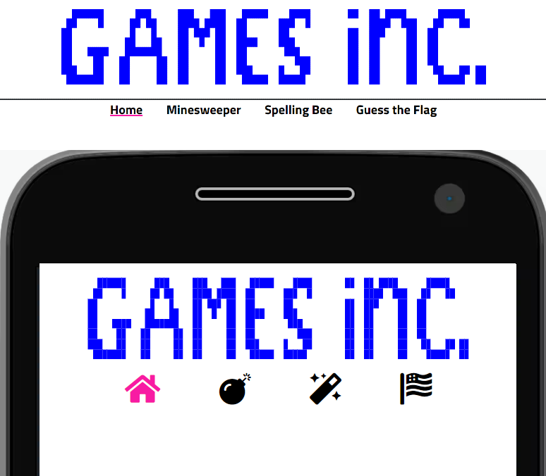

<h4>User stories covered by this feature:</h4>

User story 1: as a player, I want to be able to easily navigate to the game of my choosing.

User story 9: as a responsible adult, I want to be able to navigate the website easily to check that all its content is appropriate for children.

User story 10: as a responsible adult, I want to be able to test the games quickly and easily to make sure they are engaging but educational.

User story 14: as a site owner, I want players to understand what kind of games my website offers and to encourage them to try them.

User story 16: as a site owner, I want players to feel at home on the website and to be happy spending time there.

<h4>Feature 3: Homepage Welcome Message</h4>

The homepage features a prominent and very colourful welcome message, explaining to users what the site is for and inviting them to try its content.

It also prompts users to fill in the form below it if they have any suggestions for games they would like to play.

This is an easy and unmissable introduction to the site, easily digestible for younger users.

The main container is surrounded with decorative images that give visual representations of each of the games on offer. As well as being attractive, these
draw teh eye to the actual message. These images are foregone on smaller screens to keep the design clean.

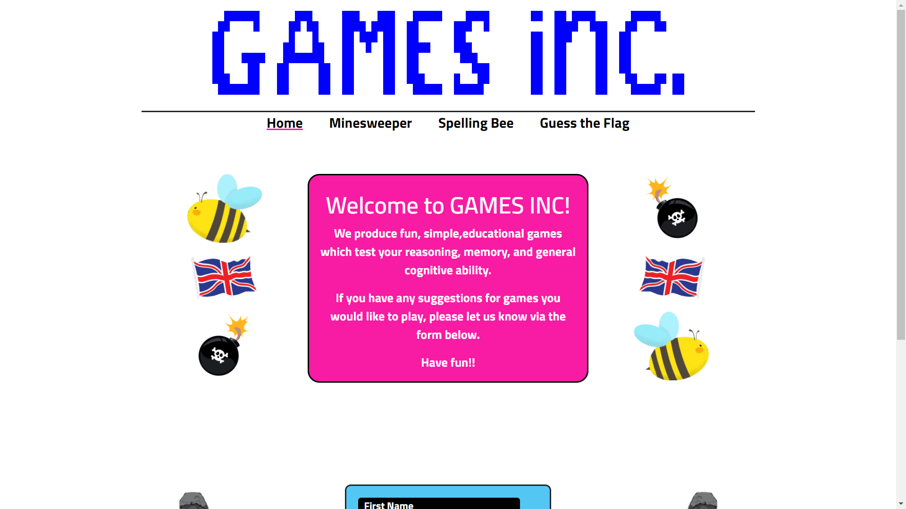

<h4>User stories covered by this feature:</h4>

User story 8: as a player, I want to be able to contact the developers with my ideas and to engage with them on social media.

User story 14: as a site owner, I want players to understand what kind of games my website offers and to encourage them to try them.

User story 16, as a site owner, I want players to feel at home on the website and to be happy spending time there.

<h4>Feature 4: Page Footer with Social Media Links</h4>

Every page has a brightly coloured footer with links to Game Inc.'s social media pages.

Each page's footer is coloured differently to tie in with the visual language of its page. The design has deliberately been kept simple, bold, and uncluttered,
with no more information than necessary. The object is to attractively enclose the page's other content and push users towards the prominent social media links.

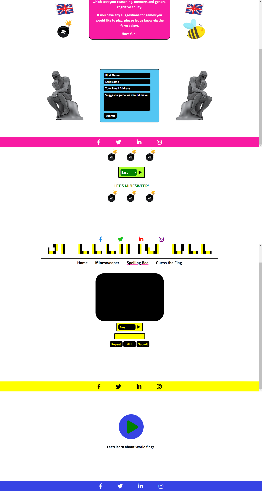

<h4>User stories covered by this feature:</h4>

User story 8: as a player, I want to be able to contact the developers with my ideas and to engage with them on social media.

User story 11: as a responsible adult, I want to be able to access the firm's social media pages to get a sense of how they engage with their users.

User story 14, as a site owner, I want responsible adults to feel assured that my website is a safe and rewarding place for yooung users to play, and to be happy to recommend it to them.

<h4>Feature 5: Form for Submission of Users' Ideas</h4>

The home page features a short form through which users can submit their suggestions for development of future games.

It has fields for first and last name, email address, and then a textarea for the ideas and suggestions themselves.

The form calls the API emailJS to send an email to my account on submission of the form, and the emailJS template then also sends 
and automatic reply to the user, employing the details they entered where appropriate.

The form is validated with Javascript code, and only submits when all fields are populated, and when a correctly constituted email
address is entered in that field.

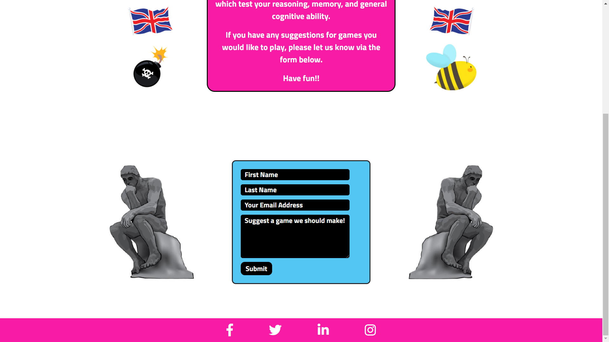

<h4>User stories covered by this feature:</h4>

User story 8, as a player, I want to be able to contact the developers with my ideas and to engage with them on social media.

User story 18, as a site owner, I want players and responsible adults to feel engaged with my firm and to want to interact with us of their own volition.

<h4>Feature 6: Minesweeper Difficulty Selector</h4>

The minesweeper game has a dropdown selector for three difficulty levels, prompted at the start of the game, and available at the top of the grid
throughout a round.

Each of the options has a predefined number of grid rows and mines, to increase or decrease the challenge as appropriate.

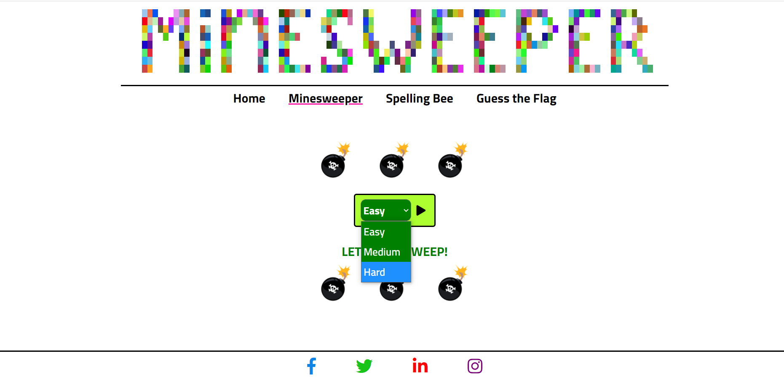

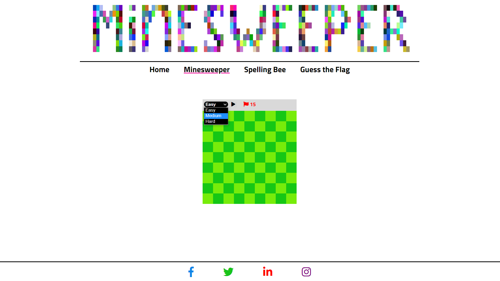

<h4>User stories covered by this feature:</h4>

User story 2, as a player, I want games that are interactive.

User story 6, as a player, I want games that that are responsive to my abilities.

User story 12, as a responsibe adult, I want the games to be responsive to the needs of the young people in my care.

User sotry 13, as a responsible adult, I want the games to be rewarding and educational.

User stroy 15, as a site owner, I want players to find the games on the website fun and rewarding.

User story 20, as a site owner, I want games that are suitable for a range of ages and ability levels.

<h4>Feature 7: Minesweeper Grid of Squares</h4>

When users click on the Minesweeper "play" button, a grid of square-shaped divs is generated, with the size dependent on the
 difficulty selected.

The minesweeper grid size is dynamic to accommodate the difficulty selector, and adapts to all different screen sizes to display in full without scrolling.

The grid is styled to resemble a chekerboard/chess board, with alternate green and lighter green squares.

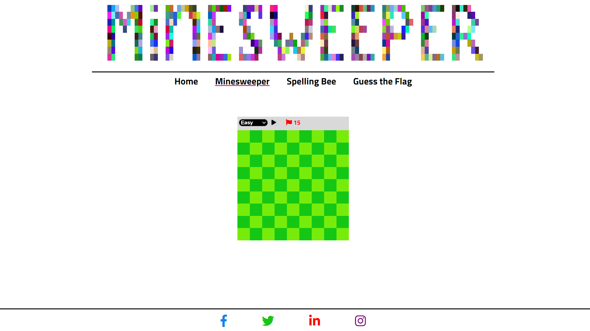

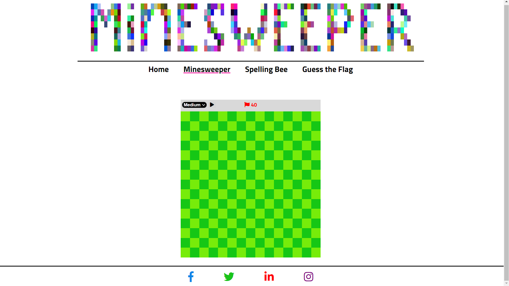

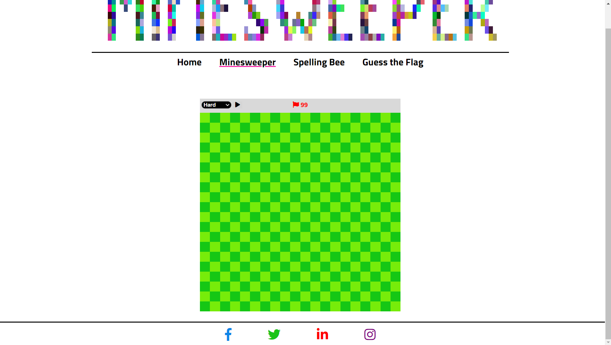

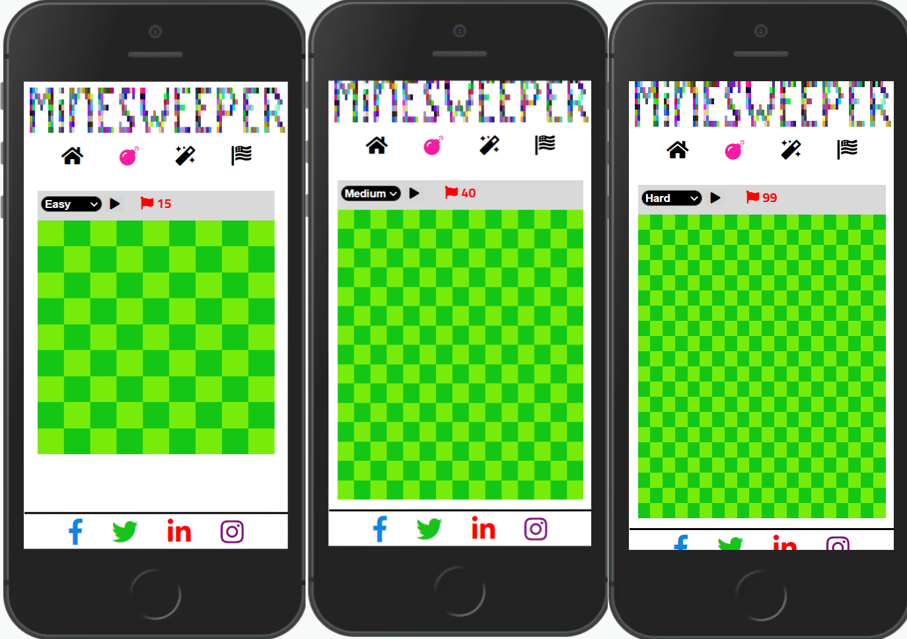

<h4>User stories covered by this feature:</h4>

User story 2, as a player, I want games that are interactive.

User story 6, as a player, I want games that that are responsive to my abilities.

User story 10, as a responsible adult, I want to be able to test the games quickly and easily to make sure they are engaging but educational.

User story 12, as a responsible adult, I want the games to be responsive to the needs of the young people in my care.

User story 21, as a site owner, I want the games to be responsive to every kind of device.

<h4>Feature 8: Minesweeper Game</h4>

Once a difficulty has been selected and the grid generated, the Minesweeper game is then ready to be played.

If the user left clicks on a square, the Javascript code will check if there is a 'mine' on that square, and if not, will run the code
to count how many mines are on the squares that surround it on the grid. It then displays that number as the square's visible content, therefore 
responding dynamically to user input. On mobile devices the click event becomes a touch event.

If the square that the user clicks on has squares surrounding it that contain zero mines, then the Javascript code calls a click method to 
automatically click on all of those squares, and to all subsequent squares that meet the same conditions. The player should therefore never
have to click on any square that displays "0" as its content.

If the user right clicks on a square, a 'flag' will be placed on that square, indicating that the user believes that a mine is on that square.
The square's responsiveness is then changed: it can no longer be left clicked on to elicit a repsonse. If the user right clicks on a square that already
contains a flag, the flag will be removed and the square returned to its original state. Hence, the right click acts as a flag on/off toggle. On mobile devices
the event is instead triggered by a long touch, of more than 300 milliseconds.

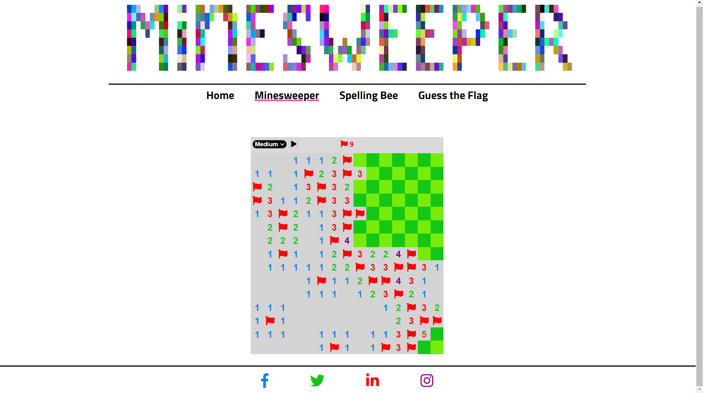

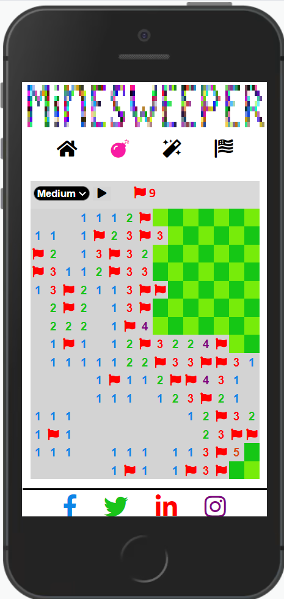

<h4>User stories covered by this feature:</h4>

User story 2, as a player, I want games that are interactive.

User story 3, as a player, I want to be able to test my reasoning abilities.

User story 10, as a responsible adult, I want to be able to test the games quickly and easily to make sure they are engaging but educational.

User story 13, as a responsible adult, I want the games to be rewarding and educational.

User story 15, as a site owner, I want players to find the games on the website fun and rewarding.

User story 21, as a site owner, I want the games to be responsive to every kind of device.

<h4>Feature 9: Minesweeper End Games Sequences</h4>

The Minesweeper game has two end of game sequences to feedback to the user and give them confirmation of their performance. One if the player
clicks on a mined square and 'loses', another if the user manages to click on every unmined square, and 'wins'.

The losing sequence consists of every square on the grid changing colour to either white, grey or black, randomly but in equal parts, one after another but
in random order. The mined squares change their color property to red so their location can be seen. Finally the whole grid changes to black and every
square has the 'skull' font awesome icon displayed, to clearly indicate the failure state!

The winning sequence works very similarly, but with bright colours and a joyful, 'laughing' emoji icon, again to clearly feed back to the player that
they have 'won' the game.

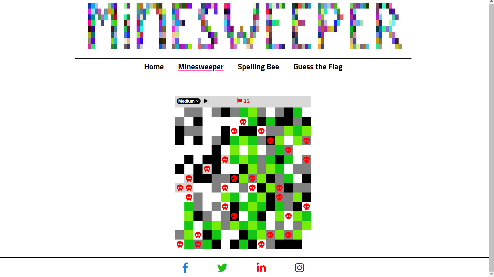

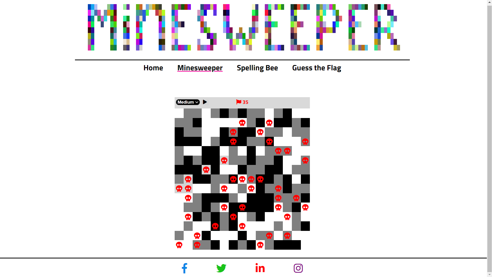

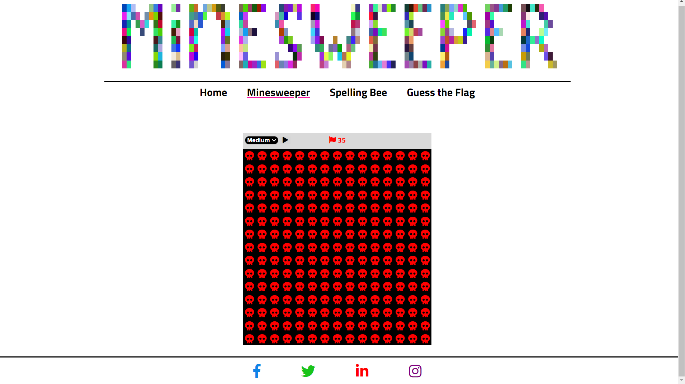

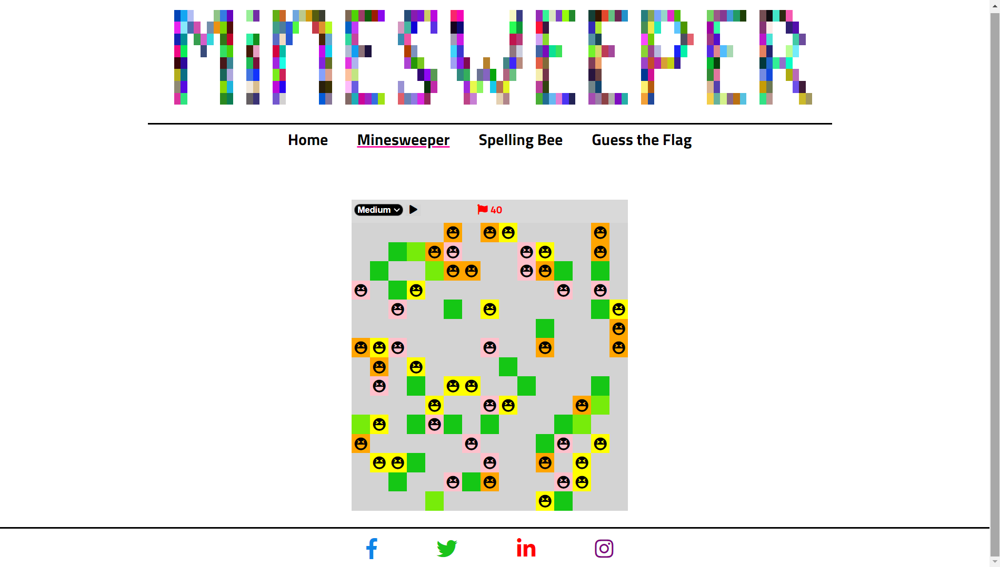

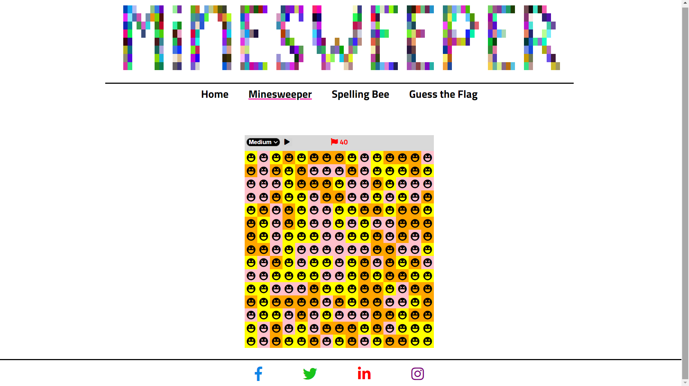

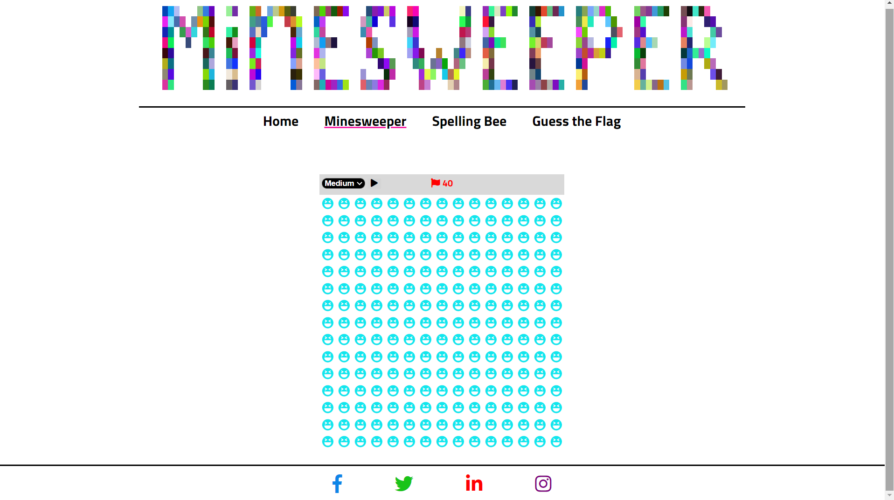

<h4>User stories covered by this feature:</h4>

User story 2, as a player, I want games that are interactive.

User story 7, as a player, I want games that give me feedback on my performance to econourage me to improve.

User story 15, as a site owner, I want players to find the games on the website fun and rewarding.

<h4>Feature 10: Spelling Bee Game Difficulty Selector</h4>

The user is presented with a drop down selector with four difficulty levels to choose between before they click on the play button.

Depending on the difficulty selected, the game will generate a random selection of ten words to test the user with from one of four
dictionaries of 200 words. These words then form the content of the quiz.

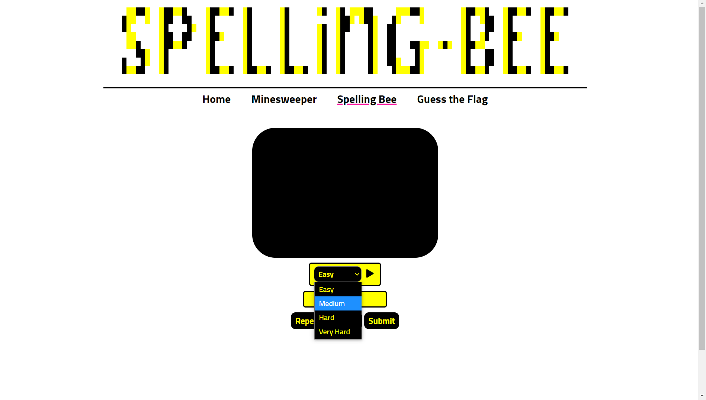

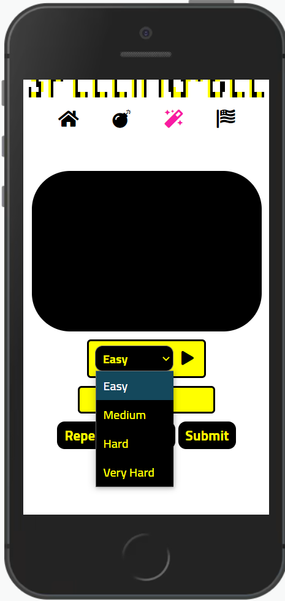

<h4>User stories covered by this feature:</h4>

User story 2, as a player, I want games that are interactive.

User story 10, as a responsible adult, I want to be able to test the games quickly and easily to make sure they are engaging but educational.

User story 12, as a responsible adult, I want the games to be responsive to the needs of the young people in my care.

User story 13, as a responsible adult, I want the games to be rewarding and educational.

User story 15, as a site owner, I want players to find the games on the website fun and rewarding.

User story 20, as a site owner, I want games that are suitable for a range of ages and ability levels.

<h4>Feature 11: Spelling Bee Game</h4>

Once the difficulty has been selected, a click on the play button will generate a random array of ten words from the relevant dictionary,
and via a call to the Responsive Voice API, the device will enunciate the first word in the array.

The page focus is then assigned to the user input element, prompting the user to attempt to spell the word.

When the user either clicks on the Submit button or presses the Return key, the Javascript code checks the value of the input
against the spelling stored in the variable. If the strings are identical (the code converts the user's input to lower case) the game's display
element presents "correct!", and if not it presents "incorrect!".

After a brief pause, the display then shows the subsequent question number, and the Responsive Voice API is called again to speak the next
word in the array. This process repeats until all the words have been spoken to the user.

After the tenth submission, and the display has presented either correct or incorrect, the display then presents the user's final score.

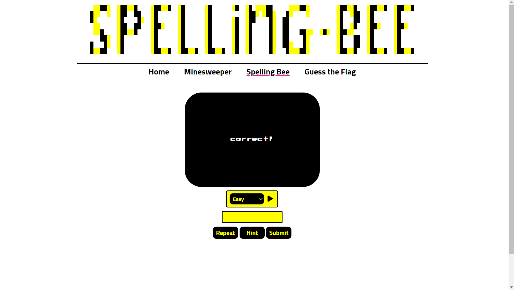

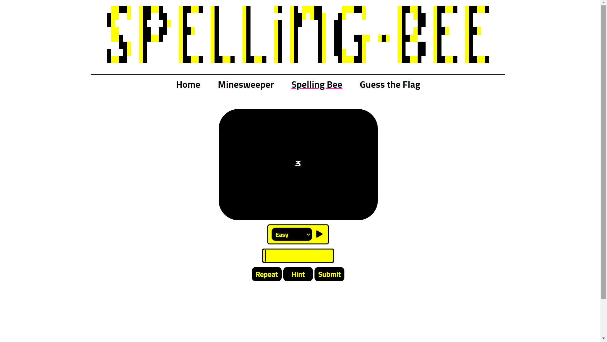

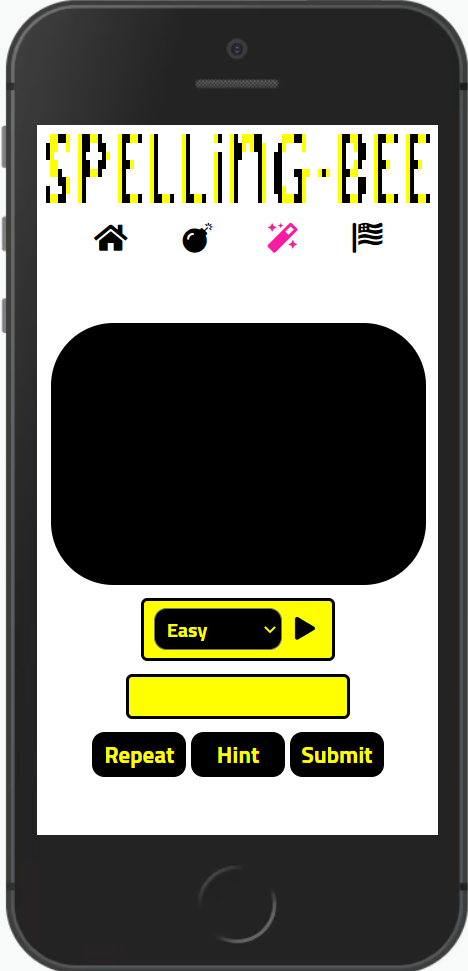

<h4>User stories covered by this feature:</h4>

User story 2, as a player, I want games that are interactive.

User story 4, as a player, I want to be able to test my spelling skills.

User story 7, player, I want games that give me feedback on my performance to encourage me to improve.

User story 13, as a responsible adult, I want the games to be rewarding and educational.

User story 17, as a site owner, I want players to find the games on the website fun and rewarding.

User story 21, as a site owner, I want the games to be responsive to every kind of device.

<h4>Feature 12: Spelling Bee Game Repeat and Hint Functions</h4>

The Spelling Bee game features Repeat and Hint buttons.

The Repeat button makes a call to the Responsive Voice API and repeats the current question to the user.

The Hint button presents the answer to the user as the content of the game display element, but with every other letter
replaced with an asterisk. The fact that the player has asked for a hint is stored in the variable, so that if the user 
subsequently submits a correct answer, only 0.5 points are added to their total score, rather than 1 point.

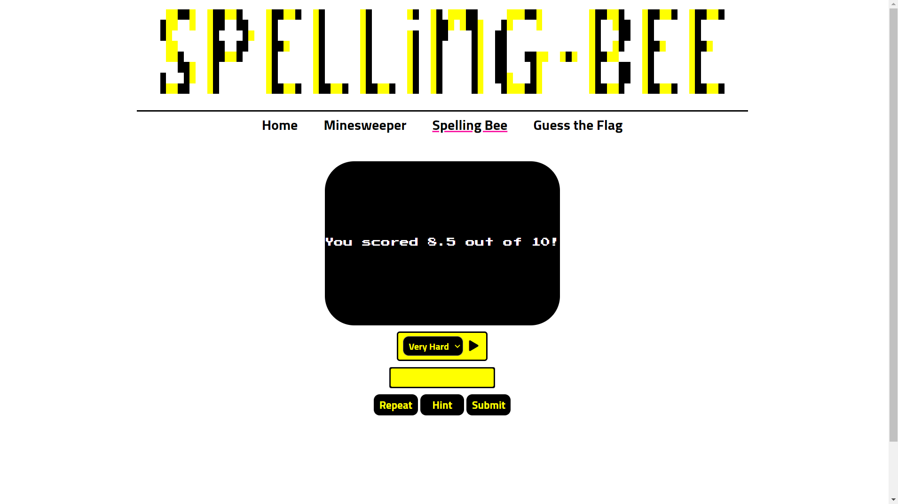

<h4>User stories covered by this feature:</h4>

User story 2, as a player, I want games that are interactive.

User story 6, as a player, I want games that are responsive to my abilities

User story 7, player, I want games that give me feedback on my performance to encourage me to improve.

User story 12, as a responsible adult, I want the games to be responsive to the needs of the young people in my care.

User story 13, as a responsible adult, I want the games to be rewarding and educational.

User story 15, as a site owner, I want players to find the games on the website fun and rewarding.

User story 20, as a site owner, I want games that are suitable for a range of ages and ability levels.

<h4>Feature 13: Guess the Flags Game</h4>

The Guess the Flags game presents an array of ten randomly selected images of national flags from the Country Flags API.

On each click of the play button the array will be repopulated at random.

Each of the ten flags displayed is accompanied by a text input element for the user to offer their attempt at naming
the nation to which the flag belongs.

On clicking the submit button, the input elements are replaced with divs displaying either a tick icon for a correct answer or
a cross icon for an incorrect answer. A message below the buttons also displays the user's score and an adaptive message depending on
how well they did. The submit button also changes to a reveal button, and if that is clicked any crosses will be 
replaced by the correct answer.

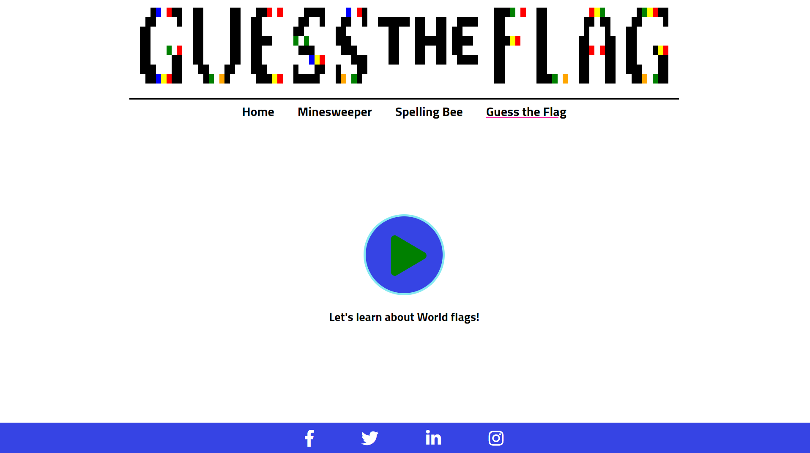

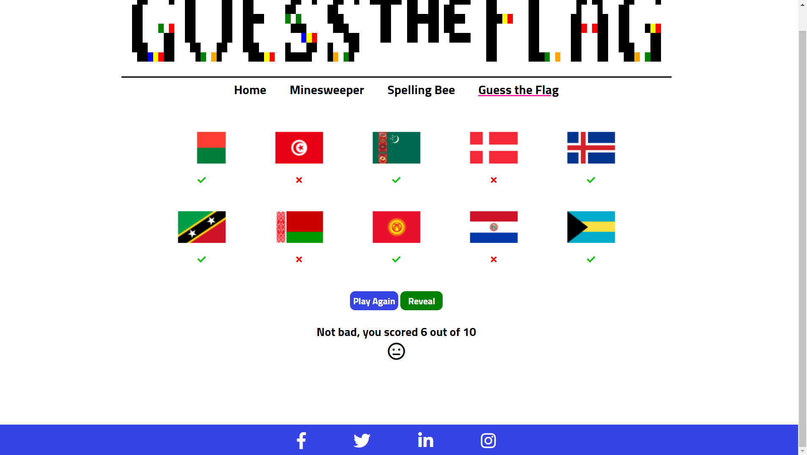

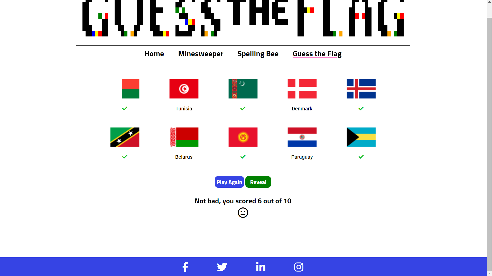

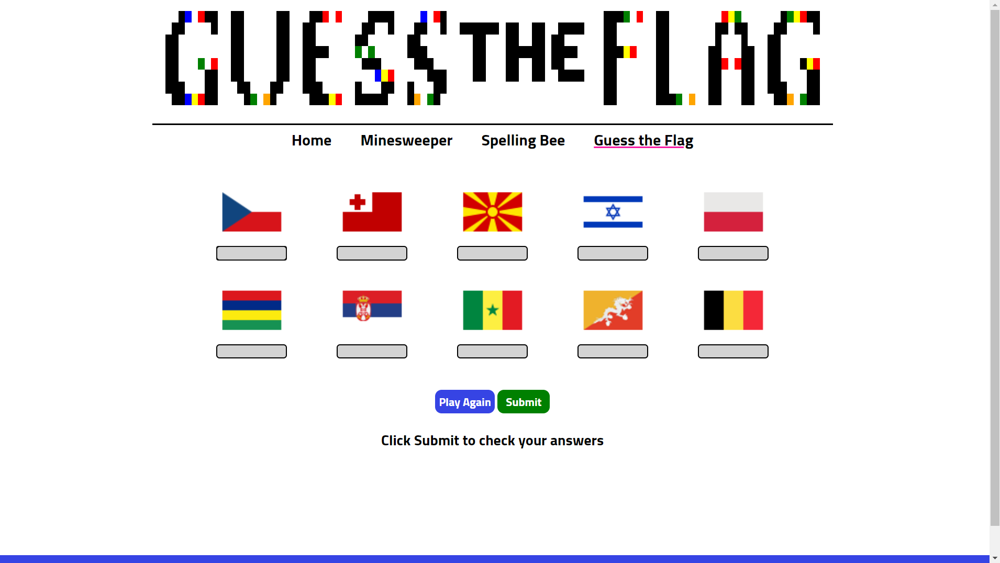

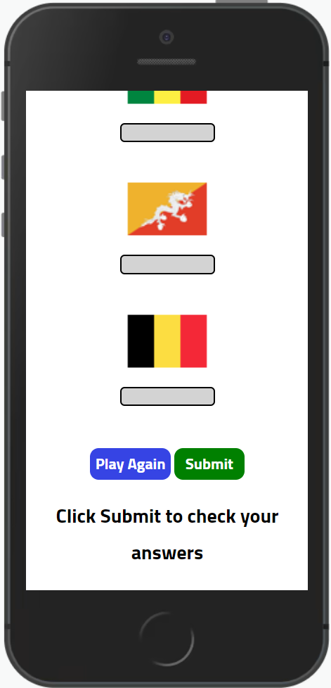

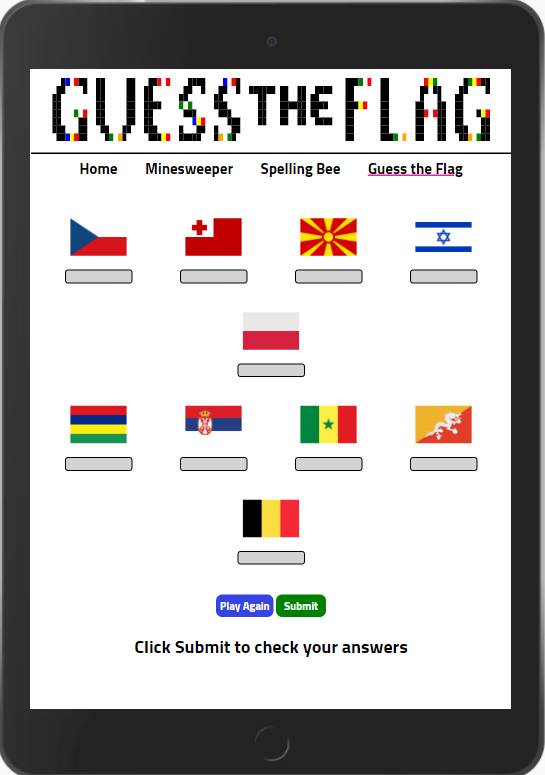

<h4>User stories covered by this feature:</h4>

User story 2, as a player, I want games that are interactive.

User story 5, as a player, I want to be able to test my general knowledge and memory.

User story 7, player, I want games that give me feedback on my performance to encourage me to improve.

User story 10, as a responsible adult, I want to be able to test the games quickly and easily to make sure they are engaging but educational.

User story 13, as a responsible adult, I want the games to be rewarding and educational.

User story 15, as a site owner, I want players to find the games on the website fun and rewarding.

User story 20, as a site owner, I want games that are suitable for a range of ages and ability levels.

User story 21, as a site owner, I want the games to be responsive to every kind of device.

<h4>Feature 14: Custom 404 error message page</h4>

This component directs any broken or missing links on the website to this explanatory error page, with the home page background, the normal title, and a prominent button inviting users to return to the home page.

<h4>Features for Future Releases</h4>

<ol>
<li>A section on the homepage with case studies of work done for clients, detailing how specific problems were solved.</li>
<li>A button in the navigation bar allowing users to book appointments with different team members, via a live calendar.</li>
<li>A dynamic landing page which would load once on the first visit to the website in any one session, with animated elements giving a welcome and a brief summary of the firm and its unique offerings.</li>
<li>A section about the firm's trainees and more junior staff, providing updates on their qualification progress and the support the firm offers, partly to further familiarise users with all aspects of the firm and partly to encourage prospective trainees to join the firm.</li>
</ol>

<h2 id="technologies-used">Technologies Used</h2>

<h3 id="languages">Languages</h3>

<ul>
<li>HTML5</li>
<li>CSS3</li>
<li>Javascript</li>
</ul>

<h3 id="frameworks-and-tools">Frameworks, libraries and other tools</h3>
<ol>
<li>Git
</li>
</ol>
<ul><li>Git was used for version control within VSCode to push the code to GitHub.</li></ul>
<ol start="2">
<li>GitHub</li>
</ol>
<ul><li>GitHub was used as a repository to store the project code.</li></ul>
<ol start="3">
<li>Balsamiq</li>
</ol>
<ul><li>Balsamiq was used to create all the wireframes for the site.</li></ul>
<ol start="4">
<li>Font Awesome</li>
</ol>
<ul><li>All the icons on the site were sourced from the Font Awesome library.</li></ul>
<ol start="5">
<li>Google Fonts</li>
</ol>
<ul><li>Cairo from the Google Fonts library was the predominant font used on the website, while Roboto from Google Fonts was
used to display the correct answers in the Guess the Flags game, and Press Start 2P from Google Fonts was used for the display
element in the Spelling Bee game.</li></ul>
<ol start="6">
<li>Bootstrap v 4.53</li>
</ol>
<ul><li>Bootstrap's grid system was used to aid layout and responsiveness on the Home page.</li></ul>
<ol start="7">
<li>Am I Responsive</li>
</ol>
<ul><li>Am I Responsive was used to create the multi-device mock-up image at the top of this README.</li></ul>
<ol start="8">
<li>Pinetools.com</li>
</ol>
<ul><li>Pinetools.com was used to combine multiple images into single .png files for this README.</li></ul>
<ol start="9">
<li>Visual Studio Code (VSCode)</li>
</ol>
<ul><li>VSCode was the IDE used for writing the project code.</li></ul>
<ol start="10">
<li>Email JS</li>
</ol>
<ul><li>The Email JS API was used to send automatic emails on submission of the form on the home page.</li></ul>
<ol start="11">
<li>Responsive Voice</li>
</ol>
<ul><li>The Responsive Voice API was used to speak the questions for the Spelling Bee game.</li></ul>
<ol start="12">
<li>CountryFlags.io</li>
</ol>
<ul><li>The library of flag image urls at countryflags.io was accessed by Javascript code to display the sets of random flags for the
Guess the Flags game.</li></ul>

<h2 id="testing">Testing</h2>

<h3 id="html-validation">HTML Validation</h3>

The <a href="https://validator.w3.org/">W3C Markup Validation Service</a> was used for HTML validation of the site. All pages passed with 0 errors. The Index and Contact Us pages have warnings for lack of section headings, which is a stylistic choice.

<h3 id="css-validation">CSS Validation</h3>

The <a href="https://jigsaw.w3.org/css-validator/">W3C CSS Validation Service</a> was used for CSS validation of the site.

The CSS passed with zero errors.

<h3 id="accessibility">Accessibility</h3>

The <a href="https://wave.webaim.org/">WAVE Webaim Accessibility Tool</a>was used for accessibility validation of the site.

The website passed with no errors. There were several warnings, due either to stylistic choices or duplicated links (eg more than one linkedin link on the Meet the Team page.

<h3 id="performance">Performance</h3>

The <a href="https://developers.google.com/speed/pagespeed/insights/">Google PageSpeed Insights</a> tool was used for performance validation of the site.

All four pages of the website scored between 80 and 90 for overall performance.

<h3 id="device-testing">Performing tests on various devices</h3>
<h4>Devices tested:</h4>
<ul>
<li>Samsung Galaxy A7</li>
<li>HP laptop</li>
<li>Motorolla</li>
<li>Ipad Pro</li>
</ul>
<h4>Tests performed:</h4>
<ol>
<li>Page links in the navigation bar work as advertised, all links work correctly in the static navbar and the collapsible mobile configuration.</li>
<li>The testimonials carousel displays appropriately, and the indicators are visible and work correctly.</li>
<li>The news stories open in modals as intended, with no scrolling on larger screens and full screen display and scrolling on mobile. The "top of page" arrow button works correctly on these devices, and the close button dismisses the modal.</li>
<li>The "Sign In" modal opens up correctly closes on a click outside the content or the cross button. The "forgotten details" link opens the subsequent modal and closes the first, as intended.</li>
<li>The "Sign In" modal form blocks submission when a mandatory field has not been completed in the required format - error message displays as intended.</li>
<li>Footer links to external websites work correctly, and open in new tabs.</li>
<li>The footer content spans the screen on larger devices, and collapses to stack on mobiles, as intended.</li>
<li>The newsletter sign up form container displays appropriately on all devices, remaining attractive and legible. The form blocks submission where any mandatory field is left unpopulated. An appropriate error message is displayed.</li>
<li>The portal registration form displays in two columns on larger screens and a single column, as intended. Content is legible and uncluttered across all devices tested.</li>
<li>The portal registration form will not submit unless all mandatory fields are completed. An error message displays as intended when triggered.</li>
<li>The contact details container displays as two columns on larger devices and one column on mobile. The content is legible and uncluttered across devices.</li>
<li>The staff profile containers display as intended on desktop, tablet, and mobile: there are three different layouts. This content needed to be resized on mobile layout to make it more legible.</li>
<li>The services containers display as intended as side by side on desktop and tablet and columnar on mobile. The content and headings are legible and attractive in all configurations.</li>
<li>The membership benefits table retains its integrity on mobile, with slightly contracted wording where required and the sacrifice of horizontal margins. Table on mobile remains legible and largely viewable without scrolling, as intended.</li>
<li>Buttons have the intended softening in colour when hovered over, as intended.</li>
<li>Page header redirects to home page on all pages</li>
</ol>

All pages worked as intended on all devices. The one major change necessitated was to move the sign in button up a little in mobile mode, as I had not accounted for the screen real estate taken up by the browser elements.

<h3 id="browser-compatibility">Browser compatability</h3>
<ul>
<li><strong>Google Chrome:</strong>Website and user stories perform as intended.</li>
<li><strong>Firefox:</strong>Website and user stories perform as intended</li>
<li><strong>Opera:</strong>Website and user stories perform as intended</li>
<li><strong>Samsung Internet Browser:</strong>Website and user stories perform as intended.</li>
</ul>

<h3 id="testing-user-stories">Testing user stories</h3>

<em>1. As a potential stakeholder, I want to know where the firm is located.</em>

<table>
<tr>
<th>Feature</th>
<th>Action</th>
<th>Expected result</th>
<th>Actual result</th>
</tr>
<tr>
<td>Address and directions details on Contact Us page</td>
<td>Click on 'Contact Us' in the navigation bar and scroll down to find the section.</td>
<td>Find address and directions on Contact Us page</td>
<td>works ass expected</td>
</tr>
</table>

<a href="docs/user-stories/us1.png">See User Story 1 images</a>

<em>2. As a potential stakeholder, I want to know how to contact the firm and its key management personnel ("KMP").</em>

<table>
<tr>
<th>Feature</th>
<th>Action</th>
<th>Expected result</th>
<th>Actual result</th>
</tr>
<tr>
<td>Contact details on Contact Us page</td>
<td>Click on 'Contact Us' in the navigation bar and scroll down to find the section.</td>
<td>Find contact details on Contact Us page</td>
<td>Works as expected</td>
</tr>
<tr>
<td>Links to KMP linkedin profiles on Meet the Team page</td>
<td>Click on 'Meet the Team' in the navigation bar and find the linkedin icon next to the name of all key team members. Click on the icon to go to their linkedin profile.</td>
<td>Find how to contact key management personnel.</td>
<td>works as exxpected.</td>
</tr>
</table>

<a href="docs/user-stories/us2.png">See User Story 2 images</a>

<em>3. As a potential stakeholder, I want to find out what the firm does and what it can offer me.</em>

<table>
<tr>
<th>Feature</th>
<th>Action</th>
<th>Expected result</th>
<th>Actual result</th>
</tr>
<tr>
<td>Our Services page explaining the firm's services</td>
<td>Click on 'Our Services' in the navigation bar and scroll down to discover each of four broad services categories. Scroll to the end to find details of the firm's membership programme.</td>
<td>Find out what the firm offers.</td>
<td>Works as expected.</td>
</tr>
</table>

<a href="docs/user-stories/us3.png">See User Story 3 images</a>

<em>4. As a potential stakeholder, I want to know who the KMP are, what their skills and experience are, and links to their social media presence.</em>

<table>
<tr>
<th>Feature</th>
<th>Action</th>
<th>Expected result</th>
<th>Actual result</th>
</tr>
<tr>
<td>Links to KMP linkedin profiles on Meet the Team page</td>
<td>Click on 'Meet the Team' in the navigation bar and find the linkedin icon next to the name of all key team members, along with a sumamry of professional history.</td>
<td>Find out who the KMP are and what their experience is.</td>
<td>works as expected.</td>
</tr>
</table>

<a href="docs/user-stories/us4.png">See User Story 4 images</a>

<em>5. As a potential stakeholder, I want to find out about the firm's membership scheme and its benefits.</em>

<table>
<tr>
<th>Feature</th>
<th>Action</th>
<th>Expected result</th>
<th>Actual result</th>
</tr>
<tr>
<td>Table listing the benefits of membership across the 3 different levels</td>
<td>Click on 'Our Services' in the navigation bar and scroll down to find the table.</td>
<td>Find out about the membership scheme and its benefits</td>
<td>Works as expected</td>
</tr>
</table>

<a href="docs/user-stories/us5.png">See User Story 5 images</a>

<em>6. As a potential stakeholder, I want to discover the firm's culture and the personalities of the KMP.</em>

<table>
<tr>
<th>Feature</th>
<th>Action</th>
<th>Expected result</th>
<th>Actual result</th>
</tr>
<tr>
<td>Staff biographies on Meet the Team page</td>
<td>Click on 'Meet the Team' in the navigation bar and the appropriate section will be displayed. Scroll down to read each biography in turn.</td>
<td>Find out about the firm's key team members' personalities and the culture of the firm.</td>
<td>Works as expected</td>
</tr>
</table>

<a href="docs/user-stories/us6.png">See User Story 6 images</a>

<em>7. As a potential stakeholder, I want to know about the firm's competencies and how its existing clients view its services.</em>

<table>
<tr>
<th>Feature</th>
<th>Action</th>
<th>Expected result</th>
<th>Actual result</th>
</tr>
<tr>
<td>Our Services page explaining the firm's services</td>
<td>Click on 'Our Services' in the navigation bar and scroll down to discover each of four broad services categories. Scroll to the end to find details of the firm's membership programme.</td>
<td>Find out what the firm offers.</td>
<td>Works as expected.</td>
</tr>
<tr>
<td>Testimonials carousel on home page</td>
<td>Click on 'home' in the navigation bar or on the title on any of the pages and the carousel will be immediately displayed.</td>
<td>Find out how the firm's clients view its services</td>
<td>Works as expected</td>
</tr>
</table>

<a href="docs/user-stories/us7.png">See User Story 7 images</a>

<em>8. As a current stakeholder, I want to be able to sign up to use the client portal.</em>

<table>
<tr>
<th>Feature</th>
<th>Action</th>
<th>Expected result</th>
<th>Actual result</th>
</tr>
<tr>
<td>Registration form for client portal on Contact Us page</td>
<td>Click on 'Contact Us' in the navigation bar and scroll down to the second container including the registration form.</td>
<td>Find out how to sign up for the client portal</td>
<td>Works as expected</td>
</tr>
</table>

<a href="docs/user-stories/us8.png">See User Story 8 images</a>

<em>9. As a current stakeholder, I want to be able to qucikly and easily log in to the client portal.</em>

<table>
<tr>
<th>Feature</th>
<th>Action</th>
<th>Expected result</th>
<th>Actual result</th>
</tr>
<tr>
<td>Sign in button for the client portal in the navigation bar</td>
<td>Click on the 'Sign In' button to the right of the navigation bar and fill in the fields of the form in the modal that is triggered.</td>
<td>Find out how to log in to the client portal</td>
<td>Works as expected</td>
</tr>
<tr>
<td>Sign in button for the client portal displayed prominently on page load (mpbile and tablet)</td>
<td>Click on the 'Sign In' button displayed near the bottom of all pages on load and fill in the fields of the form in the modal that is triggered.</td>
<td>Find out how to log in to the client portal</td>
<td>Works as expected</td>
</tr>
</table>

<a href="docs/user-stories/us9.png">See User Story 9 images</a>

<em>10. As a current stakeholder, I want to be able to easily sign up for the firm's weekly newsletter.</em>

<table>
<tr>
<th>Feature</th>
<th>Action</th>
<th>Expected result</th>
<th>Actual result</th>
</tr>
<tr>
<td>Newsletter sign up form on Contact Us page</td>
<td>Click on 'Contact Us' in the navigation bar and the container including the newsletter sign up form is prominently displayed</td>
<td>Find out how to sign up for the firm's newsletter</td>
<td>Works as expected</td>
</tr>
</table>

<a href="docs/user-stories/us10.png">See User Story 10 images</a>

<em>11. As a current stakeholder, I want to see what the latest industry news is.</em>

<table>
<tr>
<th>Feature</th>
<th>Action</th>
<th>Expected result</th>
<th>Actual result</th>
</tr>
<tr>
<td>Latest Industry News section on home page</td>
<td>Click on 'home' in the navigation bar or on the title on any of the pages and scroll down to find the news section</td>
<td>Find out the latest industry news</td>
<td>Works as expected</td>
</tr>
</table>

<a href="docs/user-stories/us11.png">See User Story 11 images</a>

<em>12. As a site owner, I want potential stakeholders to understand what my firm does and encourage them to become clients or employees.</em>

<table>
<tr>
<td>Our Services page explaining the firm's services</td>
<td>Click on 'Our Services' in the navigation bar and scroll down to discover each of four broad services categories. Scroll to the end to find details of the firm's membership programme.</td>
<td>Find out what the firm doess.</td>
<td>Works as expected.</td>
</tr>
<tr>
<td>Testimonials carousel on home page</td>
<td>Click on 'home' in the navigation bar or on the title on any of the pages and the carousel will be immediately displayed.</td>
<td>Encourage potential clients to sign up</td>
<td>Works as expected</td>
</tr>
<tr>
<td>Staff profiles on Meet the Team page</td>
<td>Click on 'Meet the Team' in the navigation bar and find the linkedin icon next to the name of all key team members, along with a sumamry of professional history.</td>
<td>Encourage potential employees to consider working for the firm</td>
<td>works as expected.</td>
</tr>
</table>

<a href="docs/user-stories/us12.png">See User Story 12 images</a>

<em>13. As a site owner, I want potential stakeholders to understand that existing clients are happy and receive an excellent service.</em>

<table>
<tr>
<th>Feature</th>
<th>Action</th>
<th>Expected result</th>
<th>Actual result</th>
</tr>
<tr>
<td>Testimonials carousel on home page</td>
<td>Click on 'home' in the navigation bar or on the title on any of the pages and the carousel will be immediately displayed.</td>
<td>Assure potential clients that existing clients are satisfied</td>
<td>Works as expected</td>
</tr>
</table>

<a href="docs/user-stories/us13.png">See User Story 13 images</a>

<em>14. As a site owner, I want potential and existing stakeholders to understand that my firm plays an active part in the local business community and that its main specialism is agribusiness.</em>

<table>
<tr>
<th>Feature</th>
<th>Action</th>
<th>Expected result</th>
<th>Actual result</th>
</tr>
<tr>
<td>Testimonials carousel on home page</td>
<td>Click on 'home' in the navigation bar or on the title on any of the pages and the carousel will be immediately displayed.</td>
<td>Show potential clients that we play an active roles in the business community</td>
<td>Works as expected</td>
</tr>
<tr>
<td>Biography of Phil De Jong, specialist in Agribusiness</td>
<td>Click on 'Meet the Team' in the navigation bar and the biography is displayed immediately</td>
<td>Show potential clients that the firm's main specialism is agribusiness</td>
<td>Works as expected</td>
</tr>
</table>

<a href="docs/user-stories/us14.png">See User Story 14 images</a>

<em>15. As a site owner, I want existing clients to be able to register for and log in to our client portal.</em>

<table>
<tr>
<th>Feature</th>
<th>Action</th>
<th>Expected result</th>
<th>Actual result</th>
</tr>
</tr>
<tr>
<td>Sign in button for the client portal in the navigation bar</td>
<td>Click on the 'Sign In' button to the right of the navigation bar and fill in the fields of the form in the modal that is triggered.</td>
<td>Allows clients to easily log in to the client portal</td>
<td>Works as expected</td>
</tr>
<tr>
<td>Sign in button for the client portal displayed prominently on page load (mpbile and tablet)</td>
<td>Click on the 'Sign In' button displayed near the bottom of all pages on load and fill in the fields of the form in the modal that is triggered.</td>
<td>Allows clients to easily log in to the client portal</td>
<td>Works as expected</td>
</tr>
<tr>
<td>Registration form for client portal on Contact Us page</td>
<td>Click on 'Contact Us' in the navigation bar and scroll down to the second container including the registration form.</td>
<td>Allows clients to register to use the client portal</td>
<td>Works as expected</td>
</tr>
</table>

<a href="docs/user-stories/us15a.png">See User Story 15 steps 1 to 2 images</a>

<a href="docs/user-stories/us15b.png">See User Story 15 steps 3 to 5 images</a>

<em>16. As a site owner, I want all users to as engaged with my business as possible, by reading our articles, signing up for services, and following us on social media.</em>

<table>
<tr>
<th>Feature</th>
<th>Action</th>
<th>Expected result</th>
<th>Actual result</th>
</tr>
<tr>
<td>Latest Industry News section on home page</td>
<td>Click on 'home' in the navigation bar or on the title on any of the pages and scroll down to find the news section</td>
<td>Encourages stakeholder engagement by providing an up-to-date news section</td>
<td>Works as expected</td>
</tr>
<tr>
<td>Newsletter and portal sign up forms on Contact Us page</td>
<td>Click on 'Contact Us' in the navigation form. Newsletter form is immediately displayed; scroll down for form enabling sign up to the portal</td>
<td>Encourages stakeholder engagement by allowing them to sign up for services</td>
<td>Works as expected</td>
</tr>
<tr>
<td>Social media links in footer section of every page</td>
<td>Load any page by clicking the links in the navigation bar and the footer and the social media links will be displayed on desktop and tablet. Scroll to the bottom on mobile</td>
<td>Encourages stakeholder engagement by prompting them to interact with the firm's social media presence</td>
<td>Works as expected</td>
</tr>
</table>

<a href="docs/user-stories/us16a.png">See User Story 16 steps 1 to 3 images</a>

<a href="docs/user-stories/us16b.png">See User Story 16 steps 4 to 6 images</a>

<h2 id="bugs">Bugs found and resolved during development</h2>

<ul>
<li><strong>Bug:</strong>The indciators on the testimonials carousel were not very visible against the background</li>
<li><strong>Fix:</strong>Created style rules for the previous and next icons and gave them larger width and height properties</li>
<li><strong>Bug:</strong>The carousel text was overflowing the container on smaller screens</li>
<li><strong>Fix:</strong>Created multiple media queries to adjust the container size and font-size on smaller devices</li>
<li><strong>Bug:</strong>The sign in button was not clickable</li>
<li><strong>Fix:</strong>After significant investigation, this turned out to be a z-index issue, with the button being 'behind' the background. Assigned the background a negative z-index property</li>
<li><strong>Bug:</strong>The modals that were edited for a dark backgorund had 'cross' close buttons that were no longer contrasted with the background and had poor visibility</li>
<li><strong>Fix:</strong>Searched Google for the issue and discovered that this can be solved by assigning the elements a CSS property of filter and a value of invert(100%)</li>
<li><strong>Bug:</strong>The text in the password reminder modal was encroaching on the submit button on mobile devices</li>
<li><strong>Fix:</strong>Inserted a br element in the text with a Bootstrap classe "d-md-none" to display the text on two lines on small and extra small devices</li>
<li><strong>Bug:</strong>The reset and submit buttons on the sign in modal were poorly aligned with the input fields on smaller screens</li>
<li><strong>Fix:</strong>Wrote various media queries for different screen sizes to fine tune the alignment</li>
<li><strong>Bug:</strong>The lack of labels on the newsletter form (by design) failed WAVE accessibility standards</li>
<li><strong>Fix:</strong>Created labels but declared that they should not be displayed, so still there for screen readers etc</li>
<li><strong>Bug:</strong>The input fields on the portal registration form were of inconsistent heights</li>
<li><strong>Fix:</strong>This was caused by the different input types defaulting inconsistently. Wrote CSS rule with a specific height to override the defaults.</li>
<li><strong>Bug:</strong>The staff photos were overflowing their containers on very large screens (tested on 1920 x 1080px)</li>
<li><strong>Fix:</strong>Wrote a media query for min-width of 1400px with a max-width property to ensure no overflow regardless of screen pixel count</li>
<li><strong>Bug:</strong>The Our Services page was loading slowly due to large background image file</li>
<li><strong>Fix:</strong>Optimised the images, making the sizes smaller.</li>
</ul>

<h2 id="deployment">Deployment</h2>

<h3>GitHub Pages</h3>

This website has been deployed using GitHub pages. The process is as follows:

<ol>
<li>Log in to your GitHub account and find the <a>repository</a></li>
<li>Click on 'Settings' once in the repository</li>
<li>Click 'Pages' in the menu on the left</li>
<li>click 'Source'</li>
<li>Open the dropdown menu 'None', and select 'Master Branch'</li>
<li>The page shold refresh automatically</li>
<li>Under GitHub pages there should now be a link to the published live website.</li>
</ol>

<h3>Forking the GitHub Repository</h3>

Forking the repository will make a copy of the original. This fork is viewable and editable without changing the original. This can be done as follows:

<ol>
<li>Log in to your GitHub account and find the repository</li>
<li>Once in the repository, click the 'Fork' button at the top right of page</li>
<li>This copy of the repository will now appear in your own account</li>
</ol>

<h3>Making a Local Clone</h3>

<ol>
<li>Log in to your GitHub account and find the repository</li>
<li>Click the 'Code' button</li>
<li>Copy the link under 'clone with HTTPS'</li>
<li>Open Git Bash</li>
<li>Change the current working direcotry to your desired directory for the clone</li>
<li>Type 'git clone' and then paste the URL in your IDE's terminal</li>
<li>Press Return</li>
<li>The local clone should now have been created</li>
</ol>

<h2 id="credits">Credits</h2>

<h3 id="code">Code</h3>
<ul>
<li><strong>Code Institute</strong> - for general instruction and inspiration for the background/text colour scheme from the "Love Running" project</li>
<li><strong>Stack Overflow</strong> - for general help with various queries, especially around positioning content. Also used for advice on how to achieve the skew effect on the Meet the Team page.</li>
<li><strong>Bootstrap</strong> - for the grid layouts on each page, the carousel component, the navigation bar, and the various modals.</li>
</ul>

<h3 id="media">Media</h3>

All the images on the website were sourced by Google Image search, and then those selected were investigated for any reseravtions of rights. The images are as follows, with as much attribution as possible:

<ul>
<li>Home page background image: appears across numerous websites, I was unable to find an original source. This is the image url used to conduct this search:

<a target="_blank" href="https://www.google.com/search?tbs=sbi:AMhZZiuvauIX0LsEu1ODNV1dAkAKFrR2sUuTXpVjVgPU8XvlHn15Y7K4OYVOdYE3UboGhHiPaGSLenSsEifZDzrC1vbo8F81Le02xv0c7lbC0xyer6yTqueUoWO3earzUZiV9EAHsbPdGaIQ6Hw5YpvYQO7s-MLkBOEaRIsr_1I7qlWn_159cwdxgPv4VlzkbOjvzfjPY3Qc6AbtEoJOgdttDyzAC2g7XscIVA238sqGy71InkDz29H1hf80Q96a623J2pCrhEe1bcpi7yD6S0oBi1_1OmZOVnZOyrEYqXv9dNEHLbo7GZn2PIfjIRoOptnmqrAQMoj057O_1M1Qsoakil1zbACtM6wMVQ&btnG=Search%20by%20image&hl=en">Homepage background image url for Google search</a>

</li>
<li>Contact Us page background image: appears across numerous websites, I was unable to find an original source. This is the url used to conduct this search:

<a target="_blank"  href="https://www.google.com/search?tbs=sbi:AMhZZitSsOJO4kaDTc5dgBUR7ZXDbOJ8V2MYI5aJsb9ph5ggtizArRqV1nIIjkN_1OG8cYx1JYcZe0xuyZw_1GX-Si8eKltENAMxIlMow6HJzvpjHwYYU6GuKOEuuw4MA5Q31qqnSRqOG4eHTmsa0Um8aBcCq5UDOJCL9qLYQEQmD97ewVamKZZOuSIKfFGvDxXGHxmETOzxZkYnCfXKq0ezok3JbyQDaWwubvOQqjCcOWxz0W3Rt4npse5pvildvAqnDtv7j-5r0U5yqlCauRlT4iip9-JEaSOZ-H-nHKGz_1K67GkbouR7UrwOZr-1y1ZVGMig8xPFAngQV8vCFC91IDPDrW2ZpQc_1w&btnG=Search%20by%20image&hl=en-GB">Contact Us background image url for Google search</a></li>

<li>Meet the Team page background image: appears across numerous websites, I was unable to find an original source. This is the url used to conduct this search:

<a target="_blank"  href="https://www.google.com/search?tbs=sbi:AMhZZivQZsl459SS1nD515M0xiVYMRAUMlJdXQLvTH9qV7oEy8QwkhKdhSZYsm0Dtm-qfrISCyLk7gCHsOcCMefkr9Is_1ARwRqI33IAVohzEYOup0dYnLKojj0F21JG9jFfPEE_1SD-DJMDNDfZO1eNzy8MpvRALwNYdMiPRr6BAWuAJSKjT0S3trAU-khRDLYwFov2W0yNCv7mio14XVg0ylfDZwgv9AKiwjcZZ-_12dSVhkN7_1kWronG65bJ5OHpUyVnqUAbnbKzHc3-wZIZRmRp0OKobVg7HlOxyG5n7GfQVbPtIX4rWSqvPwP88WK1drMsRl9_1QD7Ng0OJCxu0-OcDGU1_1x4qBVQ&btnG=Search%20by%20image&hl=en-GB">Meet the Team background image url for Google search</a></li>

<li>Our Services page background image: I was able to trace this to a Flickr account, with permission for non-commercial sharing, with no image transformation. 

<a target="_blank" href="https://www.flickr.com/photos/letscommunicate/5066054716/">User's Flickr account</a></a></li>

<a target="_blank" href="https://creativecommons.org/licenses/by-nc-nd/2.0/">Details of usage rights</a></a></li>

<li>The staff profile images were selected for size, content, and the black and white format. Their sources are as follows:
<ul>
<li><strong>"Phil De Jong"</strong>: Taken from <a href="https://fuller-roper.co.uk/contact-us/">Fuller & Roper Chartered Accountants</a></li>
<li><strong>"Liz Read"</strong>: Taken from <a href="https://www.oneplusoneaccountants.co.uk/meet-the-team/">Oneplusone Accountants</a></li>
<li><strong>"Natalie Jenkins"</strong>: Taken from <a href="https://www.heartofenglandcf.co.uk/michelle-vincent/">Heart of England</a></li>
<li><strong>"Richard Travers"</strong>: Taken from <a href="https://www.dains.com/our-people/adam-longmore">Dains Accountants</a></li>
<li><strong>"George Roberts"</strong>: Taken from <a href="https://www.hamlyns.com/About-Us/Partners-and-Managers/Jonathan-Graham">Hamlyns LLP Chartered Accountants</a></li>
</ul>
</li>

</ul>

<h3 id="acknowledgements">Acknowledgements</h3>

<ul>
<li>To my mentor Mo Shami for his support, advice, and patience.</li>
<li>To my family and friends for their help testing the site and providing valuable feedback.</li>
</ul>
