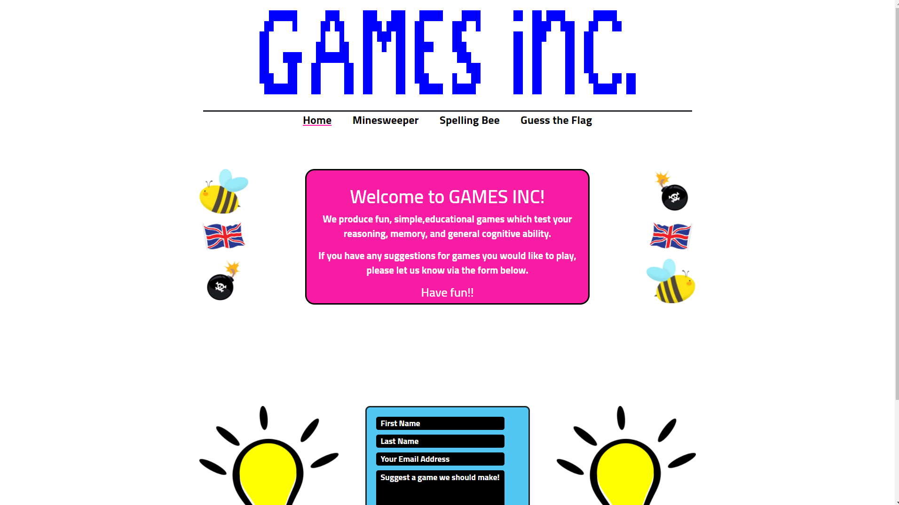
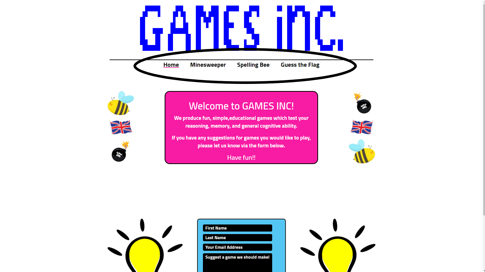

# GAMES Inc.

<a href="https://peterhague.github.io/CI_MS2_Games_Inc./" target="_blank">View the deployed website</a>

<h2>Tabel of Content</h2>

<ol>
<li><a href="#project-goals">Project Goals</a></li>
<li><a href="#user-experience">User Experience</a></li>
<ol>
<li><a href="#target-audience">Target Audience</a></li>
<li><a href="#user-stories">User stories</a></li>
<li><a href="#scope">Scope</a></li>
<li><a href="#design">Design</a></li>
<li><a href="#wireframes">Wireframes</a></li>
</ol>
</li>
<li><a href="#features">Features</a></li>
<li><a href="#technologies-used">Technologies Used</a>
<ol>
<li><a href="#languages">Languages</a></li>
<li><a href="#frameworks-and-tools">Frameworks & Tools</a></li>
</ol>
</li>
<li><a href="#testing">Testing</a></li>
<ol>
<li><a href="#html-validation">HTML Validation</a></li>
<li><a href="#css-validation">CSS Validation</a></li>
<li><a href="#accessibility">Accessibility</a></li>
<li><a href="#performance">Performance</a></li>
<li><a href="#device-testing">Device testing</a></li>
<li><a href="#browser-compatibility">Browser compatibility</a></li>
<li><a href="#testing-user-stories">Testing user stories</a></li>
</ol>
<li><a href="#bugs">Bugs</a></li>
<li><a href="#deployment">Deployment</a></li>
<li><a href="#credits">Credits</a></li>
<ol>
<li><a href="#code">Code</a></li>
<li><a href="#media">Media</a></li>
<li><a href="#acknowledgements">Acknowledgements</a></li>
</ol>
</ol>

<h2 id="project-goals">Project Goals</h2>

The business goals of Games Inc. are as follows:
<ul>
<li>To provide an online resource of educational games to its target market of 8 to 14 year olds</li>
<li>To provide a selection of different games to test various aspects of users' cognitive functioning</li>
<li>Provide a means of user contact to communicate their suggestions for new games</li>
<li>Encourage users to get in touch and provide their contact details, to build a database of engaged customers</li>
<li>Provide links to the firm's social media presence</li>
</ul>

The user goals:
<ul>
<li>To test their reasoning faculties via the Minesweeper game</li>
<li>To test their spelling ability via the Spelling Bee game</li>
<li>To test their general knowledge and memory via the Guess the Flags game</li>
<li>To be able to find out more about Games Inc. and keep in touch with them via their social media accounts</li>
<li>To be able to get in touch with Games Inc. and contact them with their feedback</li>
</ul>

<h2 id="user-experience">User Experience</h2>

The website is primarily designed for use on mobile and tablet devices, with a simple, clean layout with plenty of white
space. It is anticipated that the site's users will largely be under 16 and will tend to access it via such devices. Where
images and additional graphics have been added for larger screens, this has mainly been done to break up some of the
white space created by the additional pixels, and where the aesthetic had slipped from 'clean' to slightly 'empty'.

The main goals of the user experience design are to make clear immediately that this is a website offering educational
 games and to tempt users to play the games.

The first goal is achieved via the simple title advertising the Games Inc brand, in a typical "pixel art" style that 
users recognise as part of gaming design language, as well as the prominent welcome message. The second is achieved via bright, strong colours and cartoony imagery, 
attractive to younger users in particular, and a very clear, pared-down navigation bar offering clear access to the various games.

<h3 id="target-audience">Target Audience</h3>

<ul>
    <li>Existing users in target market</li>
    <li>Potential users in target market</li>
    <li>Parents and care-providers of potential users</li>
</ul>

<h3 id="user-stories">User Stories</h3>

There are two main categories of user anticipated for the website: existing and potential players of the games, generally anticipated to be 14 and younger (henceforth "players"), and adults who would potentially recommend the site to children in their care (henceforth "responsible adults").

<h4>Players</h4>

<ol>
    <li>As a player, I want to be able to easily navigate to the game of my choosing.</li>
    <li>As a player, I want games that are interactive.</li>
    <li>As a player, I want to be able to test my reasoning abilities.</li>
    <li>As a player, I want to be able to test my spelling skills.</li>
    <li>As a player, I want to be able to test my general knowledge and memory.</li>
    <li>As a player, I want games that that are responsive to my abilities.</li>
    <li>As a player, I want games that give me feedback on my performance to encourage me to improve.</li>
    <li>As a player, I want to be able to contact the developers with my ideas, receive confirmation that my
    contact has been received, and to engage with them on social media.</li>
</ol>

<h4>Responsible Adults</h4>

<ol start="9">
    <li>As a responsible adult, I want to be able to navigate the website easily to check that all its content is appropriate
    for children.</li>
    <li>As a responsible adult, I want to be able to test the games quickly and easily to make sure they are engaging but
    educational and provide ample feedback.</li>
    <li>As a responsible adult, I want to be able to access the firm's social media pages to get a sense of how they engage
    with their users.</li>
    <li>As a responsible adult, I want the games to be responsive to the needs of the young people in my care.</li>
    <li>As a responsible adult, I want the games to be rewarding and educational.</li>  
</ol>

<h4>Site Owner</h4>

<ol start="14">
    <li>As a site owner, I want players to understand what kind of games my website offers and to encourage them to try them.</li>
    <li>As a site owner, I want players to find the games on the website fun and rewarding.</li>
    <li>As a site owner, I want players to feel at home on the website and to be happy spending time there.</li>
    <li>As a site owner, I want the website to be attractive to younger users and keen gamers in particular.</li>
    <li>As a site owner, I want players and responsible adults to feel engaged with my firm and to want to interact with us, receiving confirmation of their contact. Their contact should be subject to validation.</li>    
    <li>As a site owner, I want responsible adults to feel assured that my website is a safe and rewarding place for yooung
    users to play, and to be happy to recommend it to them.</li>
    <li>As a site owner, I want games that are suitable for a range of ages and ability levels.</li>
    <li>As a site owner, I want the games to be responsive to every kind of device.</li>
</ol>

<h2 id="scope">Scope</h2>

The project's scope in its initial release is limited to the following features:

<ul>
<li>Navigation bar to allow users to navigate the site quickly and easily, with bold underlining to show them which page they are currently looking at.</li>
<li>A brightly coloured footer with links to the firm's social media presence.</li>
<li>A home page with a large and prominent welcome message, and a form encouraging users to contact the owners with their suggestions for future games. The form is validated by Javascript code and interfaces with the emailJS API, informing the owners
of the new message and automatically sending the user a response.</li>
<li>"Minesweeper" page with a version of the popular logic-based game, with 3 selectable difficulty levels. The page loads to a
colourful call to action to play the game. The pixel art title is decorated with different randomly coloured tiles to recall the 
appearance of a minsweeper grid, and to add vibrancy and contrast with the white space.</li>
<li>"Spelling Bee" page with a spelling contest game, with 3 selectable difficulty levels. This page accesses the Responsive 
Voice API, to "speak" the words that the user has to attempt to spell. The elements are arranged to resemble an old-fashioned
computer monitor, with the game's messages displayed as if they were the monitor's output. The whole page is decorated in a 
yellow and black "bee" aesthetic, as a pun on the spelling bee title.</li>
<li>"Guess the Flag" page with a game quizzing players on their knowledge of world flags. This page uses the Country Flags API
to access a library of flag images that is randomised and displayed on each click of the play button. Each flag has a user input
for the player to type their guess at each flag's country. The page uses a blue and green "Earth" aesthetic to match the flags theme, and the title has a fun flags motif with miniature flags adorning its letters.</li>
<li>A custom 404 "page does not exist" error page, with an error message and a prominent link to return to the home page.</li>
</ul>

Features considered for later releases:

<ul>
    <li>A section on the homepage with news about upcoming projects.</li>
    <li>A custom version of the minesweeper game, with users able to select the number of rows and mines.</li>
    <li>A timer on the minesweeper game showing the seconds elapsed since the start of the game.</li>
    <li>The ability for users to sign up and log in, so they can keep track of their scores and look at live leaderboards.</li>
</ul>

<h2 id="design">Design</h2>

The general aesthetic is colourful, retro, pixel art. It is meant to evoke 1980s video games as well as provide lots of
strong colours to appeal to younger users.

This design language influences every element of the site, from the bold, "pixelalted" titles, to the simple and vibrant footers, to the content of the games themselves. Almost all the colours on the website are bright and vividly contrasting with each other. Images are used sparingly - but where considered necessary to aid visual flow - have been chosen for their strong colours and cartoon aesthetic to sustain the overall appearance.

<h3>Colour Scheme</h3>

In general colours were chosen for their vibrancy and their appeal to younger users, with the home page dominated by bright pinks and blues. The game pages have themed colour schemes, but always with an eye on the guiding vividness.

The Minesweeper page is largely dominated by the grid itself, which has a bright green checkered effect. This grid does not appear on load, but the call to action uses the same colours to keep the look consistent. The Spelling Bee page is entirely yellow and black, as a fun play on the "Bee" in the title. The Guess the Flags page similarly echoes the blue and green of Earth to tie in with its subject matter.

<h3>Typography</h3>

Cairo from Google Fonts is used for most of the text on the website, as it seemed to mesh well with the retro style of much of the site, while itself being readable but still pleasantly informal. Roboto from Google Fonts is used for the answers in the Flags game as it used less screen space than Cairo while maintaining a similar aesthetic. Press Start 2P from Google Fonts was used for the "display" in the Spelling game, to give an old-fashioned monitor effect.

<h3>Imagery</h3>

The images on the website take the form of large icons on the Home page to represent the 3 available games. They were taken
from larger images and had their backgrounds removed with online software. There are also two cartoon light bulb images to decorate the call to get in touch on the homepage, and to focus the user on the form. The images on the website do not form a major part of the aesthetic and are used for emphasis of the prevailing design language.

<h2 id="wireframes">Wireframes</h2>

Wireframes: <a href="docs/wireframes/wireframe-home.png">Home</a><a href="docs/wireframes/wireframe-ms.png"> Minesweeper</a><a href="docs/wireframes/wireframe-spelling.png"> Spelling Bee</a><a href="docs/wireframes/wireframe-flags.png"> Guess the Flag</a>

<h2 id="features">Features</h2>

The website has fourteen features across five pages (including a 404 error page).

<h3>Current Features</h3>

<h4>Feature 1: Pixel Art Header</h4>

Every page has a bespoke title using the same basic html elements but with modified CSS via Javascript code.

The heading-container div contains ten rows of one hundred small divs, which when coloured were designed to resemble familiar 'blocky' pixellated graphics.
These divs are coloured differently on each page to make up the title, for example spelling out 'Spelling Bee' and coloured in yellow and black stripes to resemble a
bee. Each page has its own fun and bespoke design.

This design is meant to be colourful and irreverent, appealing to younger users, and evocative of computer games in general.

All page titles

<h4>User stories covered by this feature:</h4>

User story 14: as a site owner, I want players to understand what kind of games my website offers and to encourage them to try them.

User story 16: as a site owner, I want players to feel at home on the website and to be happy spending time there.

User story 17: as a site owner, I want the website to be attractive to younger users and keen gamers in particular.

User story 21, as a site owner, I want the games to be responsive to every kind of device.

<h4>Feature 2: Navigation Bar for Desktop and Mobile</h4>

Every page has a navigation bar designed to be easy to use and clearly separated from its surrounding elements.

To this end, a minimalist aesthetic has been employed, with no background colour, stark black type, and bold bright pink underlining for the current page.

For smaller screens, I chose to replace the wording with icons, but kept the basic layout rather than cluttering the design with a collapsible menu/burger-icon
combination. The colour scheme is maintained, as well as the distance from other elements. The pink underline is replaced with highlighting.

The navigation bar is easily accessible and almost always present on screen on both mobile and desktop, to facilitate good user experience and fast navigation.

Navigation bar on mobile and desktop devices

<h4>User stories covered by this feature:</h4>

User story 1: as a player, I want to be able to easily navigate to the game of my choosing.

User story 9: as a responsible adult, I want to be able to navigate the website easily to check that all its content is appropriate for children.

User story 10: as a responsible adult, I want to be able to test the games quickly and easily to make sure they are engaging but
    educational and provide ample feedback.

User story 14: as a site owner, I want players to understand what kind of games my website offers and to encourage them to try them.

User story 16: as a site owner, I want players to feel at home on the website and to be happy spending time there.

<h4>Feature 3: Homepage Welcome Message</h4>

The homepage features a prominent and very colourful welcome message, explaining to users what the site is for and inviting them to try its content.

It also prompts users to fill in the form below it if they have any suggestions for games they would like to play.

This is an easy and unmissable introduction to the site, easily digestible for younger users.

The main container is surrounded with decorative images that give visual representations of each of the games on offer. As well as being attractive, these
draw the eye to the actual message. These images are foregone on smaller screens to keep the design clean.

Home page with welcome message

<h4>User stories covered by this feature:</h4>

User story 8: as a player, I want to be able to contact the developers with my ideas, and receive confirmation that my
    contact has been received, and to engage with them on social media.

User story 14: as a site owner, I want players to understand what kind of games my website offers and to encourage them to try them.

User story 16, as a site owner, I want players to feel at home on the website and to be happy spending time there.

<h4>Feature 4: Page Footer with Social Media Links</h4>

Every page has a brightly coloured footer with links to Game Inc.'s social media pages.

Each page's footer is coloured differently to tie in with the visual language of its page. The design has deliberately been kept simple, bold, and uncluttered,
with no more information than necessary. The object is to attractively bookend the page's other content and push users towards the prominent social media links.

Footer on each of the pages

<h4>User stories covered by this feature:</h4>

User story 8: as a player, I want to be able to contact the developers with my ideas, and receive confirmation that my
    contact has been received, and to engage with them on social media.

User story 11: as a responsible adult, I want to be able to access the firm's social media pages to get a sense of how they engage with their users.

User story 14, as a site owner, I want responsible adults to feel assured that my website is a safe and rewarding place for yooung users to play, and to be happy to recommend it to them.

<h4>Feature 5: Form for Submission of Users' Ideas</h4>

The home page features a short form through which users can submit their suggestions for development of future games.

It has fields for first and last name, email address, and then a textarea for the ideas and suggestions themselves.

The form calls the API emailJS to send an email to my account on submission of the form, and the emailJS template then also sends 
an automatic reply to the user, employing the details they entered where appropriate.

The form is validated with Javascript code, and only submits when all fields are populated, and when a correctly constituted email
address is entered in that field.

Home page form inviting user ideas

<h4>User stories covered by this feature:</h4>

User story 8, as a player, I want to be able to contact the developers with my ideas, and receive confirmation that my
    contact has been received, and to engage with them on social media.

User story 18, as a site owner, I want players and responsible adults to feel engaged with my firm and to want to interact with us, receiving confirmation of their contact. Their contact should be subject to validation.

<h4>Feature 6: Minesweeper Difficulty Selector</h4>

The minesweeper game has a dropdown selector for three difficulty levels, prompted at the start of the game, and available at the top of the grid
throughout a round.

Each of the options has a predefined number of grid rows and mines, to increase or decrease the challenge as appropriate.

Minesweeper difficulty selectors, pre-game and mid-game

<h4>User stories covered by this feature:</h4>

User story 2, as a player, I want games that are interactive.

User story 6, as a player, I want games that that are responsive to my abilities.

User story 12, as a responsibe adult, I want the games to be responsive to the needs of the young people in my care.

User sotry 13, as a responsible adult, I want the games to be rewarding and educational.

User stroy 15, as a site owner, I want players to find the games on the website fun and rewarding.

User story 20, as a site owner, I want games that are suitable for a range of ages and ability levels.

<h4>Feature 7: Minesweeper Grid of Squares</h4>

When users click on the Minesweeper "play" button, a grid of square-shaped divs is generated, with the size dependent on the
 difficulty selected.

The minesweeper grid size is dynamic to accommodate the difficulty selector, and adapts to all different screen sizes to display in full without scrolling.

The grid is styled to resemble a chekerboard/chess board, with alternate green and lighter green squares.

Minesweeper grid in each difficulty and in mobile configuration

<h4>User stories covered by this feature:</h4>

User story 2, as a player, I want games that are interactive.

User story 6, as a player, I want games that that are responsive to my abilities.

User story 10, as a responsible adult, I want to be able to test the games quickly and easily to make sure they are engaging but
    educational and provide ample feedback.

User story 12, as a responsible adult, I want the games to be responsive to the needs of the young people in my care.

User story 21, as a site owner, I want the games to be responsive to every kind of device.

<h4>Feature 8: Minesweeper Game</h4>

Once a difficulty has been selected and the grid generated, the Minesweeper game is then ready to be played.

If the user left clicks on a square, the Javascript code will check if there is a 'mine' on that square, and if not, will run the code
to count how many mines are on the squares that surround it on the grid. It then displays that number as the square's visible content, therefore 
responding dynamically to user input. On mobile devices the click event becomes a touch event.

If the square that the user clicks on has squares surrounding it that contain zero mines, then the Javascript code calls a click method to 
automatically click on all of those squares, and to all subsequent squares that meet the same conditions. The player should therefore never
have to click on any square that displays "0" as its content.

If the user right clicks on a square, a 'flag' will be placed on that square, indicating that the user believes that a mine is on that square.
The square's responsiveness is then changed: it can no longer be left clicked on to elicit a repsonse. If the user right clicks on a square that already
contains a flag, the flag will be removed and the square returned to its original state. Hence, the right click acts as a flag on/off toggle. On mobile devices
the event is instead triggered by a long touch, of more than 300 milliseconds.

Minesweeper grid half-solved in desktop and mobile configurations

<h4>User stories covered by this feature:</h4>

User story 2, as a player, I want games that are interactive.

User story 3, as a player, I want to be able to test my reasoning abilities.

User story 10, as a responsible adult, I want to be able to test the games quickly and easily to make sure they are engaging but
    educational and provide ample feedback.

User story 13, as a responsible adult, I want the games to be rewarding and educational.

User story 15, as a site owner, I want players to find the games on the website fun and rewarding.

User story 21, as a site owner, I want the games to be responsive to every kind of device.

<h4>Feature 9: Minesweeper End Games Sequences</h4>

The Minesweeper game has two end of game sequences to feedback to the user and give them confirmation of their performance. One if the player
clicks on a mined square and 'loses', another if the user manages to click on every unmined square, and 'wins'.

The losing sequence consists of every square on the grid changing colour to either white, grey or black, randomly but in equal parts, one after another but
in random order. The mined squares change their color property to red so their location can be seen. Finally the whole grid changes to black and every
square has the 'skull' font awesome icon displayed, to unambiguously indicate the failure state.

The winning sequence works very similarly, but with bright colours and a joyful, 'laughing' emoji icon, again to clearly feed back to the player that
they have 'won' the game.

Minesweeper game over sequence

Minesweeper game won sequence

<h4>User stories covered by this feature:</h4>

User story 2, as a player, I want games that are interactive.

User story 7, as a player, I want games that give me feedback on my performance to econourage me to improve.

User story 15, as a site owner, I want players to find the games on the website fun and rewarding.

<h4>Feature 10: Spelling Bee Game Difficulty Selector</h4>

The user is presented with a drop down selector with four difficulty levels to choose between before they click on the play button.

Depending on the difficulty selected, the game will generate a random selection of ten words to test the user with from one of four
dictionaries of 200 words. These words then form the content of the quiz.

Spelling Bee difficulty selector on desktop and mobile devices

<h4>User stories covered by this feature:</h4>

User story 2, as a player, I want games that are interactive.

User story 10, as a responsible adult, I want to be able to test the games quickly and easily to make sure they are engaging but
    educational and provide ample feedback.

User story 12, as a responsible adult, I want the games to be responsive to the needs of the young people in my care.

User story 13, as a responsible adult, I want the games to be rewarding and educational.

User story 15, as a site owner, I want players to find the games on the website fun and rewarding.

User story 20, as a site owner, I want games that are suitable for a range of ages and ability levels.

<h4>Feature 11: Spelling Bee Game</h4>

Once the difficulty has been selected, a click on the play button will generate a random array of ten words from the relevant dictionary,
and via a call to the Responsive Voice API, the device will enunciate the first word in the array.

The page focus is then assigned to the user input element, prompting the user to attempt to spell the word.

When the user either clicks on the Submit button or presses the Return key, the Javascript code checks the value of the input
against the spelling stored in the variable. If the strings are identical (the code converts the user's input to lower case) the game's display
element presents "correct!", and if not it presents "incorrect!".

After a brief pause, the display then shows the subsequent question number, and the Responsive Voice API is called again to speak the next
word in the array. This process repeats until all the words have been spoken to the user.

After the tenth submission, and the display has presented either correct or incorrect, the display then presents the user's final score.

Spelling Bee correct and incorrect answer messages

Spelling Bee next question message and final score presentation

Spelling Bee game in mobile configuration

<h4>User stories covered by this feature:</h4>

User story 2, as a player, I want games that are interactive.

User story 4, as a player, I want to be able to test my spelling skills.

User story 7, player, I want games that give me feedback on my performance to encourage me to improve.

User story 13, as a responsible adult, I want the games to be rewarding and educational.

User story 17, as a site owner, I want players to find the games on the website fun and rewarding.

User story 21, as a site owner, I want the games to be responsive to every kind of device.

<h4>Feature 12: Spelling Bee Game Repeat and Hint Functions</h4>

The Spelling Bee game features Repeat and Hint buttons.

The Repeat button makes a call to the Responsive Voice API and repeats the current question to the user.

The Hint button presents the answer to the user as the content of the game display element, but with every other letter
replaced with an asterisk. The fact that the player has asked for a hint is stored in the variable, so that if the user 
subsequently submits a correct answer, only 0.5 points are added to their total score, rather than 1 point.

Spelling Bee hint presentation, and final score with half mark awarded

<h4>User stories covered by this feature:</h4>

User story 2, as a player, I want games that are interactive.

User story 6, as a player, I want games that are responsive to my abilities

User story 7, player, I want games that give me feedback on my performance to encourage me to improve.

User story 12, as a responsible adult, I want the games to be responsive to the needs of the young people in my care.

User story 13, as a responsible adult, I want the games to be rewarding and educational.

User story 15, as a site owner, I want players to find the games on the website fun and rewarding.

User story 20, as a site owner, I want games that are suitable for a range of ages and ability levels.

<h4>Feature 13: Guess the Flags Game</h4>

The Guess the Flags game presents an array of ten randomly selected images of national flags from the Country Flags API.

On each click of the play button the array will be repopulated at random.

Each of the ten flags displayed is accompanied by a text input element for the user to offer their attempt at naming
the nation to which the flag belongs.

On clicking the submit button, the input elements are replaced with divs displaying either a tick icon for a correct answer or
a cross icon for an incorrect answer. A message below the buttons also displays the user's score and an adaptive message depending on
how well they did. The submit button also changes to a reveal button, and if that is clicked any crosses will be 
replaced by the correct answer.

Guess the Flag game in various stages of progress

Guess the Flag game mobile and tablet configurations

<h4>User stories covered by this feature:</h4>

User story 2, as a player, I want games that are interactive.

User story 5, as a player, I want to be able to test my general knowledge and memory.

User story 7, player, I want games that give me feedback on my performance to encourage me to improve.

User story 10, as a responsible adult, I want to be able to test the games quickly and easily to make sure they are engaging but
    educational and provide ample feedback.

User story 13, as a responsible adult, I want the games to be rewarding and educational.

User story 15, as a site owner, I want players to find the games on the website fun and rewarding.

User story 20, as a site owner, I want games that are suitable for a range of ages and ability levels.

User story 21, as a site owner, I want the games to be responsive to every kind of device.

<h4>Feature 14: Custom 404 error message page</h4>

This component directs any broken or missing links on the website to this explanatory error page, with a prominent error message and 'Return to Home page'
call to action, presented in sympathetic retro font.

Images of 404 page in desktop and mobile configurations

<h4>Features for Future Releases</h4>

<ol>
<li>A section on the homepage with news about upcoming projects.</li>
<li>A custom version of the minesweeper game, with users able to select the number of rows and mines.</li>
<li>A timer on the minesweeper game showing the seconds elapsed since the start of the game.</li>
<li>The ability for users to sign up and log in, so they can keep track of their scores and look at live leaderboards.</li>
</ol>

<h2 id="Game Instructions"></h2>

<ul>
<li>Minesweeper
<li>Choose a difficulty from the dropdown menu presented when the page loads</li>
<li>Click on the Play icon to generate the Minesweeper grid</li>
<li>You need to discover which squares have mines hidden beneath them and which don't</li>
<li>If you left-click on a square with a mine beneath it, it's game over</li>
<li>However, you need to left click on one of the squares to start the game, so pick one and take your chances</li>
<li>If you click on a square with no mine beneath it, you will be shown a number. This number represents how many of that 
square's surrounding squares contain mines. By comparing that to the number of squares you have already discover with and 
without mines, you can start 'clearing' the squares.</li>
<li>Where you are sure there is a mine, you can right click on the mouse to lay a flag as a marker. This will also prevent
you from being able to left-click on that square by accident. If you make a mistake, you can right-click on that square again
to remove the flag.</li>
<li>If you clear all the unmined squares, you win!</li>
</li>
<ul>
</ul>
<li>Spelling Bee</li>

bbbbbbbbbbbbbbbbbbbbbbbbbbbbbbbbbbbb

<li>Guess the Flag</li>

bbbbbbbbbbbbbbbbbbbbbbbbbbbbbbbbbbbb

</ul>

<h2 id="technologies-used">Technologies Used</h2>

<h3 id="languages">Languages</h3>

<ul>
<li>HTML5</li>
<li>CSS3</li>
<li>Javascript</li>
</ul>

<h3 id="frameworks-and-tools">Frameworks, libraries and other tools</h3>
<ol>
<li>Git
</li>
</ol>
<ul><li>Git was used for version control within VSCode to push the code to GitHub.</li></ul>
<ol start="2">
<li>GitHub</li>
</ol>
<ul><li>GitHub was used as a repository to store the project code.</li></ul>
<ol start="3">
<li>Balsamiq</li>
</ol>
<ul><li>Balsamiq was used to create all the wireframes for the site.</li></ul>
<ol start="4">
<li>Font Awesome</li>
</ol>
<ul><li>All the icons on the site were sourced from the Font Awesome library.</li></ul>
<ol start="5">
<li>Google Fonts</li>
</ol>
<ul><li>Cairo from the Google Fonts library was the predominant font used on the website, while Roboto from Google Fonts was
used to display the correct answers in the Guess the Flags game, and Press Start 2P from Google Fonts was used for the display
element in the Spelling Bee game.</li></ul>
<ol start="6">
<li>Bootstrap v 4.13</li>
</ol>
<ul><li>Bootstrap's grid system was used to aid layout and responsiveness on the Home page.</li></ul>
<ol start="7">
<li>Am I Responsive</li>
</ol>
<ul><li>Am I Responsive was used to create the multi-device mock-up image at the top of this README.</li></ul>
<ol start="8">
<li>Pinetools.com</li>
</ol>
<ul><li>Pinetools.com was used to combine multiple images into single .png files for this README.</li></ul>
<ol start="9">
<li>Visual Studio Code (VSCode)</li>
</ol>
<ul><li>VSCode was the IDE used for writing the project code.</li></ul>
<ol start="10">
<li>Email JS</li>
</ol>
<ul><li>The Email JS API was used to send automatic emails on submission of the form on the home page.</li></ul>
<ol start="11">
<li>Responsive Voice</li>
</ol>
<ul><li>The Responsive Voice API was used to speak the questions for the Spelling Bee game.</li></ul>
<ol start="12">
<li>CountryFlags.io</li>
</ol>
<ul><li>The library of flag image urls at countryflags.io was accessed by Javascript code to display the sets of random flags for the
Guess the Flags game.</li></ul>
<ol start="13">
<li>jQuery v3.6</li>
</ol>
<ul><li>JQuery was used for certain Javascript code to shorten certain expressions and to facilitate the right click event-handling for the Minesweeper game.</li></ul>
<ol start="14">
<li>Remove.bg</li>
</ol>
<ul><li>The online software at remove.bg was used to remove the backgrounds from the images used on the Home page.</li></ul>

<h2 id="testing">Testing</h2>

<h3 id="html-validation">HTML Validation</h3>

The <a href="https://validator.w3.org/" target="_blank">W3C Markup Validation Service</a> was used for HTML validation of the site. All pages passed with zero errors or warnings.

W3C HTML validation of each page with no errors or alerts

<h3 id="css-validation">CSS Validation</h3>

The <a href="https://jigsaw.w3.org/css-validator/" target="_blank">W3C CSS Validation Service</a> was used for CSS validation of the site.

The CSS passed with zero errors.

W3C CSS validation of each page with no errors

<h3 id="accessibility">Accessibility</h3>

The <a href="https://wave.webaim.org/" target="_blank">WAVE Webaim Accessibility Tool</a>was used for accessibility validation of the site.

The website passed with zero errors or alerts.

WAVE Webaim accessibility validation of each page with no errors or alerts

<h3 id="performance">Performance</h3>

The <a href="https://developers.google.com/speed/pagespeed/insights/" target="_blank">Google PageSpeed Insights</a> tool was used for performance validation of the site.

All pages of the website scored 90 or above for overall performance, except the home page which scored 84.

Google PageSpeed Insights performance validation of each page

<h3 id="device-testing">Performing tests on various devices</h3>
<h4>Devices tested:</h4>
<ul>
<li>Samsung Galaxy A7</li>
<li>HP 250 G7 laptop</li>
<li>Apple Iphone X</li>
<li>Apple Ipad Pro</li>
</ul>
<h4>Tests performed:</h4>
<ol>
<li>Page links in the navigation bar work as advertised, all links work correctly in the desktop and mobile configurations. The links to other
pages trun bright pink on hover, as intended.</li>
<li>All the buttons across all pages repsond to hover events in some way, either with a small decrease in opacity or a reversal of their color and
background-color properties.</li>
<li>The welcome message displays as intended, on both desktop and mobile and tablet configurations. The images are not displayed on smaller screens, as intended.</li>
<li>The form on the home page generates error messages when any field is missing required information. If everything is filled in correctly, a successful call to
the emailJS API is made and the notifying email is received and the automatic reply is sent.</li>
<li>The minesweeper difficulty selector works as intended, with a dropdown menu with the 3 difficulty options. The appropriate grid is then generated with a click
of the play button.</li>
<li>The three grid sizes all display as intended, across all devices tested. No scrolling is necessary at any point. On mobile devices, the biggest grid
does become slightly difficult to interact with, but this can be solved by zooming in with the hardware functionality. This is perhaps less than ideal but
perfectly workable.</li>
<li>A left click on a minesweeper square elicits the desired response. Either the square is cleared and the number of adjacent mines is displayed, or the game over sequence
begins.</li>
<li>A left click on a minesweeper square with zero adjacent mines generates the intended response: all squares with zero adjacent mines are automatically clicked in a cascading fashion,
until the code reaches squares with inner htmls of 1 or higher. No squares with a zero content need to be manually clicked.</li>
<li>A touch on the minesweeper squares in mobile configuration generates a response equivalent to a left click in desktop mode, as intended.</li>
<li>A right click on the minesweeper squares places a flag icon to signal the presense of a mine. With a flag in place, a left click on the square now returns zero response.
Another right click removes the flag. Once it has been removed, the square responds to left clicks in the same manner it would have done before the first placement of the flag.</li>
<li>A long touch on a minesweeper square in mobile configuration provides exactly the same funcitonality as a right click does in desktop configuration, as intended.</li>
<li>The placement of a flag reduces the flags in hand counter at the top of the grid by one. Removing the flag increases the counter by one. All as intended.</li>
<li>The game over sequence that is triggered on a left click of a mined square works as intended on all devices tested. A third of the squares turn white, a third, grey,
and a third black. Which squares turn which colour is randomly assigned. The order in which any of the squares turn their eventual colour is also random.
Squares changed colour one at a time, with a very small delay between each. Once all squares have changed colour, there is a small pause, and then all squares
 turn black, with red text, again as intended.</li>
<li>The game won sequence that is triggered on a left click of the last-cleared unmined square works as intended on all devices tested. A third of the squares turn yellow, a third, orange, and a third pink. Which squares turn which colour is randomly assigned. The order in which any of the squares turn their eventual colour is also random.
Squares changed colour one at a time, with a very small delay between each. Once all squares have changed colour, there is a small pause, and then all squares turn white, with 
light blue text, again as intended.</li>
<li>The spelling bee game displays as intended across all devices tested. All key elements of the game are displayed at once across all devices, as intended.</li>
<li>The spelling bee difficulty selector works as intended. The correct dictionary of words is selected from for each option.</li>
<li>The spelling bee play button starts the game as intended. The input field is given focus. The game's display element displays the number 1 to
signal the first question. The Responsive Voice API speaks the first word in the random array.</li>
<li>During the game, a click on the Submit button works as intended, passing the value of the input field for testing. A correct or incorrect message is displayed
as appropriate.</li>
<li>The answer submission process then displays the next question's number in the display element, and after a brief pause, speaks the next word.</li>
<li>The answer submission process can also be triggered by a press of the return key, as long as the input field has focus. This is as intended.</li>
<li>After ten questions are asked, the display element presents the final score. The number of correct and incorrect answers are counted correctly.</li>
<li>During the spelling bee game, a click on the Repeat button works as intended: the current question is spoken again by the Responsive Voice API.</li>
<li>During the spelling bee game, a click on the Hint button works as intended: the current question's answer is dislplayed to the user, but with
alternate letters replaced by aterisks.</li>
<li>Answers submitted correctly following the display of a hint are correctly counted as only half a point towards the final score.</li>
<li>The Guess the Flag (GTF) game loads correcly on all devices, with the large round Play button prominently displayed near the centre of all screens.
The element responds to a cursor hover with the display of a lighter blue 'halo' effect, as intended.</li>
<li>The GTF play button responds as intended: ten random flags are displayed with associated input fields to return answers. The first input field is provided focus.</li>
<li>A click on the GTF Submit button checks all answers provided in the input fields. An incorrectly returned input field is replaced with a div displaying a red
cross/times icon. A correctly returned input field is replaced with a div displaying a green tick icon.</li>
<li>The click on the GTF Submit button displays the user's score, and a dynamic message dependent on that score.</li>
<li>Finally, the click on the GTF submit button changes the button's wording to 'Reveal', as intended.</li>
<li>A click on the GTF Reveal button replaces any red cross/times icon with the actual correct answer.</li>
<li>A click on the GTF Play Again button returns all elements to their original state, and generates a new array of random flags.</li>
</ol>

All pages worked as intended on all devices.

<h3 id="browser-compatibility">Browser compatability</h3>
<ul>
<li><strong>Google Chrome:</strong> Website and user stories perform as intended.</li>
<li><strong>Firefox:</strong> Website and user stories perform as intended</li>
<li><strong>Opera:</strong> Website and user stories perform as intended</li>
<li><strong>Samsung Internet Browser:</strong> Website and user stories perform as intended.</li>
</ul>

<h3 id="testing-user-stories">Testing user stories</h3>

<em>1. As a player, I want to be able to easily navigate to the game of my choosing.</em>

<table>
<tr>
<th>Feature</th>
<th>Action</th>
<th>Expected result</th>
<th>Actual result</th>
</tr>
<tr>
<td>Navigation bar under every page's title</td>
<td>Click on any of the links in the navigation bar</td>
<td>Navigate to the linked page</td>
<td>works as expected</td>
</tr>
</table>

Image walking through testing of User Story 1

<em>2. As a player, I want games that are interactive.</em>

<table>
<tr>
<th>Feature</th>
<th>Action</th>
<th>Expected result</th>
<th>Actual result</th>
</tr>
<tr>
<td>Minesweeper game.</td>
<td>Click on the Minesweeper link in the navigation bar, and press the game's play button.</td>
<td>Experience games which respond to my inputs.</td>
<td>Works as expected</td>
</tr>
<tr>
<td>Spelling Bee game.</td>
<td>Click on the Spelling Bee link in the navigation bar, and press the game's play button.</td>
<td>Experience games which respond to my inputs.</td>
<td>works as exxpected.</td>
</tr>
<tr>
<td>Guess the Flag game.</td>
<td>Click on the Guess the Flag link in the navigation bar, and press the game's play button.</td>
<td>Experience games which respond to my inputs.</td>
<td>works as exxpected.</td>
</tr>
</table>

Images walking through testing of User Story 2

<em>3. As a player, I want to be able to test my reasoning abilities.</em>

<table>
<tr>
<th>Feature</th>
<th>Action</th>
<th>Expected result</th>
<th>Actual result</th>
</tr>
<tr>
<td>Minesweeper game</td>
<td>Click on the Minesweeper link in the navigation bar, and press the game's play button. Click on one of the squares in the grid.
The number represents the number of surrounding squares that contain a mine and therefore should not be clicked on. One can reason
which squares have the highest probability of not having a mine by the combination of the displayed numbers from the accumulated
clicks.</td>
<td>Test my reasoning abilities.</td>
<td>Works as expected.</td>
</tr>
</table>

Images walking through testing of User Story 3

<em>4. As a player, I want to be able to test my spelling skills.</em>

<table>
<tr>
<th>Feature</th>
<th>Action</th>
<th>Expected result</th>
<th>Actual result</th>
</tr>
<tr>
<td>Spelling Bee game.</td>
<td>Click on the Spelling Bee link in the navigation bar, and press the game's play button. The game will speak a word it wants you to spell.
Type your attempt in the input field, and the game will display to you whether you were correct or incorrect.</td>
<td>Test my spelling skills.</td>
<td>Works as expected.</td>
</tr>
</table>

Images walking through testing of User Story 4

<em>5. As a player, I want to be able to test my general knowledge and memory.</em>

<table>
<tr>
<th>Feature</th>
<th>Action</th>
<th>Expected result</th>
<th>Actual result</th>
</tr>
<tr>
<td>Guess the Flag game.</td>
<td>Click on the Guess the Flag link in the navigation bar, and press the game's play button. The game will display 10 random national flags, with associated
input fields. Type your attempt into each field according to your general knowledge. Press the Submit button to see your score. Press the Play Again
button for repeated attempts and to gradually improve your scores by committing the flags to memory.</td>
<td>Test my general knowledge and memory</td>
<td>Works as expected</td>
</tr>
</table>

Images walking through testing of User Story 5

<em>6. As a player, I want games that that are responsive to my abilities.</em>

<table>
<tr>
<th>Feature</th>
<th>Action</th>
<th>Expected result</th>
<th>Actual result</th>
</tr>
<tr>
<td>Minesweeper game difficulty selector.</td>
<td>Click on Minesweeper link in the navigation bar, and click on the drop down menu field. Click on one of the 3 options, then click the play
button. The grid displayed will be easier or harder to complete depending on the seleciton made.</td>
<td>Find games that respond to my abiltiy level.</td>
<td>Works as expected</td>
</tr>
<tr>
<td>Spelling Bee game difficulty selector.</td>
<td>Click on Spelling Bee link in the navigation bar, and click on the drop down menu field. Click on one of the 4 options, then click the play
button. The words spoken as questions will be easier or harder depending on the selection made.</td>
<td>Find games that respond to my ability level.</td>
<td>Works as expected</td>
</tr>
<tr>
<td>Spelling Bee game hint function.</td>
<td>Click on Spelling Bee link in the navigation bar, and click the play button. After any word is spoken, click on the Hint button, and the correct
answer will be displayed, but with alternate letters replaced with asterisks.</td>
<td>Find games that respond to my ability level.</td>
<td>Works as expected</td>
</tr>
</table>

Images walking through testing of User Story 6

<em>7. As a player, I want games that give me feedback on my performance to encourage me to improve.</em>

<table>
<tr>
<th>Feature</th>
<th>Action</th>
<th>Expected result</th>
<th>Actual result</th>
</tr>
<tr>
<td>Minesweeper end of game sequences</td>
<td>Click on Minesweeper link on the navigation bar. Click on the play button. Click on the squares of the grid to play the game.
If you successfully click on all unmined squares, the game will feed back to you that you have won. If you click on a mined square, the 
game will feed back to you that you have lost.</td>
<td>Receive feedback on my performance at the games</td>
<td>Works as expected.</td>
</tr>
<tr>
<td>Spelling Bee final score display</td>
<td>Click on Spelling Bee link in the navigation bar and press the play button. Attempt to spell each spoken word in turn. After the 10th answer, 
the game will display your score out of 10, with half marks where hints have been given.</td>
<td>Receive feedback on my performance at the games</td>
<td>Works as expected</td>
</tr>
<td>Guess the Flag final score display</td>
<td>Click on Guess the Flag link in the navigation bar and press the play button. Attempt to identify each of the flags by typing in the fields
provided. Press Submit button to check your answers, and your score out of 10 will be displayed.</td>
<td>Receive feedback on my performance at the games</td>
<td>Works as expected</td>
</tr>
</table>

Images walking through testing of User Story 7

<em>8. As a player, I want to be able to contact the developers with my ideas, and receive confirmation that my
    contact has been received, and to engage with them on social media.</em>

<table>
<tr>
<th>Feature</th>
<th>Action</th>
<th>Expected result</th>
<th>Actual result</th>
</tr>
<tr>
<td>Home page form for submitting suggestions</td>
<td>Click on the Home link in the navigation bar and scroll down to the form. Fill in each field as indicated, and enter your suggestions
in the text box. Click the submit button to send the information to the developers.</td>
<td>Contact the developers with my ideas.</td>
<td>Works as expected</td>
</tr>
<tr>
<td>Footer on each page with links to the firm's social media pages</td>
<td>On any page, if necessary scroll to the bottom of the page, and click on one of the social media icons to open a new tab and
navigate to the relevant page.</td>
<td>Engage with the developers on social media.</td>
<td>Works as expected</td>
</tr>
</table>

Images walking through testing of User Story 8

<em>9. As a responsible adult, I want to be able to navigate the website easily to check that all its content is appropriate for children.</em>

<table>
<tr>
<th>Feature</th>
<th>Action</th>
<th>Expected result</th>
<th>Actual result</th>
</tr>
<td>Navigation bar under every page's title</td>
<td>Click on any of the links in the navigation bar</td>
<td>Navigate to the linked page</td>
<td>works as expected</td>
</table>

Image walking through testing of User Story 9

<em>10. As a responsible adult, I want to be able to test the games quickly and easily to make sure they are engaging but
    educational and provide ample feedback.</em>

<table>
<tr>
<th>Feature</th>
<th>Action</th>
<th>Expected result</th>
<th>Actual result</th>
</tr>
<tr>
<td>Minesweeper game.</td>
<td>Click on the Minesweeper link in the navigation bar, and press the game's play button.</td>
<td>Test the game quickly and easily for appropriate and valuable content.</td>
<td>Works as expected</td>
</tr>
<tr>
<td>Spelling Bee game.</td>
<td>Click on the Spelling Bee link in the navigation bar, and press the game's play button.</td>
<td>Test the game quickly and easily for appropriate and valuable content.</td>
<td>works as exxpected.</td>
</tr>
<tr>
<td>Guess the Flag game.</td>
<td>Click on the Guess the Flag link in the navigation bar, and press the game's play button.</td>
<td>Test the game quickly and easily for appropriate and valuable content.</td>
<td>works as exxpected.</td>
</tr>
</table>

Images walking through testing of User Story 10

<em>11. As a responsible adult, I want to be able to access the firm's social media pages to get a sense of how they engage with their users.</em>

<table>
<tr>
<th>Feature</th>
<th>Action</th>
<th>Expected result</th>
<th>Actual result</th>
</tr>
<tr>
<td>Footer on each page with links to the firm's social media pages</td>
<td>On any page, if necessary scroll to the bottom of the page, and click on one of the social media icons to open a new tab and
navigate to the relevant page.</td>
<td>Access firm's social media pages to verify the quality of their engagement with users.</td>
<td>Works as expected</td>
</tr>
</table>

Image walking through testing of User Story 11

<em>12. As a responsible adult, I want the games to be responsive to the needs of the young people in my care.</em>

<table>
<tr>
<th>Feature</th>
<th>Action</th>
<th>Expected result</th>
<th>Actual result</th>
</tr>
<tr>
<td>Minesweeper game difficulty selector.</td>
<td>Click on Minesweeper link in the navigation bar, and click on the drop down menu field. Click on one of the 3 options, then click the play
button. The grid displayed will be easier or harder to complete depending on the seleciton made.</td>
<td>Verify that the games are responsive to the needs of their users</td>
<td>Works as expected</td>
</tr>
<tr>
<td>Spelling Bee game difficulty selector.</td>
<td>Click on Spelling Bee link in the navigation bar, and click on the drop down menu field. Click on one of the 4 options, then click the play
button. The words spoken as questions will be easier or harder depending on the selection made.</td>
<td>Verify that the games are responsive to the needs of their users</td>
<td>Works as expected</td>
</tr>
<tr>
<td>Spelling Bee game hint function.</td>
<td>Click on Spelling Bee link in the navigation bar, and click the play button. After any word is spoken, click on the Hint button, and the correct
answer will be displayed, but with alternate letters replaced with asterisks.</td>
<td>Verify that the games are responsive to the needs of their users</td>
<td>Works as expected</td>
</tr>
</table>

Images walking through testing of User Story 12

<em>13. As a responsible adult, I want the games to be rewarding and educational.</em>

<table>
<tr>
<th>Feature</th>
<th>Action</th>
<th>Expected result</th>
<th>Actual result</th>
</tr>
<tr>
<td>Minesweeper game</td>
<td>Click on the Minesweeper link in the navigation bar, and press the game's play button. Click on one of the squares in the grid.
The number represents the number of surrounding squares that contain a mine and therefore should not be clicked on. One can reason
which squares have the highest probability of not having a mine by the combination of the displayed numbers from the accumulated
clicks.</td>
<td>Verify that the games are rewarding and educational.</td>
<td>Works as expected.</td>
</tr>
<tr>
<td>Spelling Bee game.</td>
<td>Click on the Spelling Bee link in the navigation bar, and press the game's play button. The game will speak a word it wants you to spell.
Type your attempt in the input field, and the game will display to you whether you were correct or incorrect.</td>
<td>Verify that the games are rewarding and educational.</td>
<td>Works as expected.</td>
</tr>
<tr>
<td>Guess the Flag game.</td>
<td>Click on the Guess the Flag link in the navigation bar, and press the game's play button. The game will display 10 random national flags, with associated
input fields. Type your attempt into each field according to your general knowledge. Press the Submit button to see your score. Press the Play Again
button for repeated attempts and to gradually improve your scores by committing the flags to memory.</td>
<td>Verify that the games are rewarding and educational.</td>
<td>Works as expected</td>
</tr>
</table>

Images walking through testing of User Story 13

<em>14. As a site owner, I want players to understand what kind of games my website offers and to encourage them to try them.</em>

<table>
<tr>
<th>Feature</th>
<th>Action</th>
<th>Expected result</th>
<th>Actual result</th>
</tr>
<tr>
<td>Welcome message home page</td>
<td>Click on 'home' in the navigation bar and read the welcome message describing the games available and be inspired by the 
call to try them.</td>
<td>Explain the nature of the games and encourage users to try them.</td>
<td>Works as expected</td>
</tr>
</table>

Image walking through testing of User Story 14

<em>15. As a site owner, I want players to find the games on the website fun and rewarding.</em>

<table>
<tr>
<th>Feature</th>
<th>Action</th>
<th>Expected result</th>
<th>Actual result</th>
</tr>
</tr>
<tr>
<td>Minesweeper game</td>
<td>Click on the Minesweeper link in the navigation bar, and press the game's play button. Click on one of the squares in the grid.
The number represents the number of surrounding squares that contain a mine and therefore should not be clicked on. One can reason
which squares have the highest probability of not having a mine by the combination of the displayed numbers from the accumulated
clicks. Keep reasoning and clicking until you win, or try again.</td>
<td>Verify that the games are fun and rewarding.</td>
<td>Works as expected.</td>
</tr>
<tr>
<td>Spelling Bee game.</td>
<td>Click on the Spelling Bee link in the navigation bar, and press the game's play button. The game will speak a word it wants you to spell.
Type your attempt in the input field, and the game will display to you whether you were correct or incorrect. Keep making attempts
until you receive a final score.</td>
<td>Verify that the games are fun and rewarding</td>
<td>Works as expected.</td>
</tr>
<tr>
<td>Guess the Flag game.</td>
<td>Click on the Guess the Flag link in the navigation bar, and press the game's play button. The game will display 10 random national flags, with associated
input fields. Type your attempt into each field according to your general knowledge. Press the Submit button to see your score. Press the Play Again
button for repeated attempts and to gradually improve your scores by committing the flags to memory.</td>
<td>Verify that the games are fun and rewarding.</td>
<td>Works as expected</td>
</tr>
</table>

Images walking through testing of User Story 15

<em>16. As a site owner, I want players to feel at home on the website and to be happy spending time there.</em>

<table>
<tr>
<th>Feature</th>
<th>Action</th>
<th>Expected result</th>
<th>Actual result</th>
</tr>
<tr>
<td>Welcome message</td>
<td>Click on 'home' in the navigation bar and read the welcome message prominently displayed</td>
<td>Warmly welcomes the player and encourages them to spend their time at the site</td>
<td>Works as expected</td>
</tr>
</table>

Image walking through testing of User Story 16

<em>17. As a site owner, I want the website to be attractive to younger users and keen gamers in particular.</em>

<table>
<tr>
<th>Feature</th>
<th>Action</th>
<th>Expected result</th>
<th>Actual result</th>
</tr>
<tr>
<td>Pixel art titles</td>
<td>Click on any of the links in the navigation bar and see the given page's title rendered in vibrant, retro, pixel-art
aesthetic.</td>
<td>Colourful and fun aesthetic that appeals to younger users and is evocative of gaming.</td>
<td>Works as expected</td>
</tr>
</table>

Image walking through testing of User Story 17

<em>18. As a site owner, I want players and responsible adults to feel engaged with my firm and to want to interact with us, receiving confirmation of their contact. Their contact should be subject to validation.</em>

<table>
<tr>
<th>Feature</th>
<th>Action</th>
<th>Expected result</th>
<th>Actual result</th>
</tr>
<tr>
<td>Welcome message</td>
<td>Click on 'home' in the navigation bar and read the welcome message encouraging users to contact the firm</td>
<td>Engages the user and points them to the contact form, welcoming their input</td>
<td>Works as expected</td>
</tr>
<tr>
<td>Form for submission of users' suggestions</td>
<td>Click on the home link in the navigation bar and scroll down to the form, and fill in each field in turn before clicking submit</td>
<td>Facilitates user engagement.</td>
<td>Works as expected</td>
</tr>
<tr>
<td>Footer with social media links</td>
<td>Click on any of the links in the navigation bar and scroll to the bottom of the page. Click on any of the prominent icons
to navigate to the firm's relevant social media presence.</td>
<td>Encourages voluntary engagement via social media interactivity</td>
<td>Works as expected</td>
</tr>
</table>

Images walking through testing of User Story 18

<em>19. As a site owner, I want responsible adults to feel assured that my website is a safe and rewarding place for young users to play, and to be happy to recommend it to them.</em>

<table>
<tr>
<th>Feature</th>
<th>Action</th>
<th>Expected result</th>
<th>Actual result</th>
</tr>
<tr>
<td>Minesweeper game.</td>
<td>Click on the Minesweeper link in the navigation bar, and press the game's play button.</td>
<td>The simple interface allows easy testing of and navigation between the games.</td>
<td>Works as expected</td>
</tr>
<tr>
<td>Spelling Bee game.</td>
<td>Click on the Spelling Bee link in the navigation bar, and press the game's play button.</td>
<td>The simple interface allows easy testing of and navigation between the games.</td>
<td>works as exxpected.</td>
</tr>
<tr>
<td>Guess the Flag game.</td>
<td>Click on the Guess the Flag link in the navigation bar, and press the game's play button.</td>
<td>The simple interface allows easy testing of and navigation between the games.</td>
<td>works as exxpected.</td>
</tr>
</table>

Images walking through testing of User Story 19

<em>20. As a site owner, I want games that are suitable for a range of ages and ability levels.</em>

<table>
<tr>
<th>Feature</th>
<th>Action</th>
<th>Expected result</th>
<th>Actual result</th>
</tr>
<tr>
<td>Minesweeper game difficulty selector.</td>
<td>Click on Minesweeper link in the navigation bar, and click on the drop down menu field. Click on one of the 3 options, then click the play
button. The grid displayed will be easier or harder to complete depending on the seleciton made.</td>
<td>Verify that the minesweeper game is responsive to different ability levels</td>
<td>Works as expected</td>
</tr>
<tr>
<td>Spelling Bee game difficulty selector.</td>
<td>Click on Spelling Bee link in the navigation bar, and click on the drop down menu field. Click on one of the 4 options, then click the play
button. The words spoken as questions will be easier or harder depending on the selection made.</td>
<td>Verify that the spelling bee game is responsive to different ability levels</td>
<td>Works as expected</td>
</tr>
<tr>
<td>Spelling Bee game hint function.</td>
<td>Click on Spelling Bee link in the navigation bar, and click the play button. After any word is spoken, click on the Hint button, and the correct
answer will be displayed, but with alternate letters replaced with asterisks.</td>
<td>Further verify that the spelling bee game is responsive to different ability levels.</td>
<td>Works as expected</td>
</tr>
</table>

Images walking through testing of User Story 20

<em>21. As a site owner, I want the games to be responsive to every kind of device.</em>

<table>
<tr>
<th>Feature</th>
<th>Action</th>
<th>Expected result</th>
<th>Actual result</th>
</tr>
<tr>
<td>Minesweeper mobile and tablet configurations</td>
<td>Click on the bomb icon in the navbar on a mobile or small tablet device. Touch the play button. Interact with the grid's squares
by touching or long-touching them.</td>
<td>Verify that the minesweeper game is fully playable on all devices.</td>
<td>Works as expected</td>
</tr>
<tr>
<td>Spelling Bee mobile and tablet configurations</td>
<td>Click on the wand icon in the navbar on a mobile or small tablet device. Touch the play button. Enter your attempt at spelling each
word via the pop-up keyboard. Press return to submit your attempts.</td>
<td>Verify that the spelling bee game is fully playable on all devices.</td>
<td>Works as expected</td>
</tr>
<tr>
<td>Guess the Flag mobile and tablet configurations</td>
<td>Click on the flag icon in the navbar on a mobile or small tablet device. Touch the play button. Enter your attempts at identifying
each flag's nation via the pop-up keyborad. Close the keyboard by pressing your device's native 'back' button. Touch the submit button
to receive your score.</td>
<td>Verify that the Guess the Flag game is fully playable on all devices.</td>
<td>Works as expected</td>
</tr>
</table>

Images walking through testing of User Story 21

<h2 id="bugs">Bugs found and resolved during development</h2>

<ul>
<li><strong>Bug:</strong> Guess the Flag: used a for loop to try to populate an array of 10 unique random numbers, was falling short when numbers duplicated</li>
<li><strong>Fix:</strong> Used a while loop instead, so the loop was infinite until the array's length was 10</li>
<li><strong>Bug:</strong> Guess the Flag: the new game button swaps out the answer div elements for input fields, but this presented as a very brief 'spasm'
effect on screen, with the content being pulled down to the bottom of the page.</li>
<li><strong>Fix:</strong> Used an overlaying blank div that would display instead with a breif timeout, so that the effect was hidden by a simple blank screen.</li>
<li><strong>Bug:</strong> Minesweeper: struggled to get the right click event working with normal Javascript.</li>
<li><strong>Fix:</strong> Used Jquery mousedown method and a swtich case with case 3 being the right mouse button.</li>
<li><strong>Bug:</strong> Minesweeper: the squares were still not clickable as the default event was generating the normal menu</li>
<li><strong>Fix:</strong> Added oncontext menu attribute to #grid element to prevent the behaviour.</li>
<li><strong>Bug:</strong> Minesweeper: the squares' inner html (ie the numbers to be displayed on a click) could be displayed by dragging the cursor across them
and highlighting the text.</li>
<li><strong>Fix:</strong> Added CSS property of user-select: none to each square</li>
<li><strong>Bug:</strong> Minesweeper: tried to replace the right click event with a long click event for touch screen devices, but the code did not work.</li>
<li><strong>Fix:</strong> Used touchstart and touchend events instead.</li>
<li><strong>Bug:</strong> Minesweeper: the long touch event was interfering with the normal touch event, and was often triggering the latter as well as the former.</li>
<li><strong>Fix:</strong> Used a setTimeout function to remove the regular touch event handler for a very brief period after a long touch event had been triggered.</li>
<li><strong>Bug:</strong> Minesweeper: the code to automatically click on squares with an inner HMTL of '0' was creating an infinite loop and crashing the browser.</li>
<li><strong>Fix:</strong> The function was clicking on squares with a certain identifying class forever, so for each simulated click I added a new class to the clicked
element and added a condition to the main click event handler to only run if 'this' did not have a class list that contained that newly-assigned class name.</li>
<li><strong>Bug:</strong> Minesweeper: the automating code was clicking on all the squares with the class 'clciked-square-radius', which was actually all the 
squares surrounding every square that had already been clicked on.</li>
<li><strong>Fix:</strong> On each new click of a square, removed the class 'clicked-square-radius' from ALL squares, so that only the squares surrounding the last-clicked
square would be addressed by the automating code.</li>
<li><strong>Bug:</strong> Minesweeper: removing the 'clicked-square-radius' class from each square meant that only the first of any of the surrounding squares was being
automatically clicked on, because the 'memory' of which squares to click was being lost on each simulated click.</li>
<li><strong>Fix:</strong> In place of the general 'clicked-square-radius' class, used a template literal to add a class to each surrounding square that referred to 
the clicked square's id, and redirected the automating code to click on squares with classes that contain its id.</li>
<li><strong>Bug:</strong> Spelling Bee: the game was not iterating through the array of words but was speaking the first word repeatedly</li>
<li><strong>Fix:</strong> On each submission of an answer, increased the value of the currentQuestion variable by 1 and passed it as a parameter
to the speak function, to stand for the iteration of the randomWords array to be passed to the Responsive Voice API.</li>
<li><strong>Bug:</strong> Spelling Bee: the Hint function was not displaying the answer as intended, with aternate letters replaced by askterisks.</li>
<li><strong>Fix:</strong> Used the split method to convert the answers into arrays that can be iterated over.</li>
<li><strong>Bug:</strong> Spelling Bee: difficulty selector was not working</li>
<li><strong>Fix:</strong> Added a "change" event listener to the select element, and to generate a new list of random words on each change.</li>
<li><strong>Bug:</strong> Home page: the images decorating the welcome message and form were distorting the layout in various configurations.</li>
<li><strong>Fix:</strong> Rewrote the html to utilise the Bootstrap grid system to provide a much more robust layout across all device types.</li>
<li><strong>Bug:</strong> Home page: the form was submitting and calling emailJS even if the names submitted contained numbers and special characters.</li>
<li><strong>Fix:</strong> Added the letters variable to define which characters were considered valid, and then used the match method to verify that
the values of those inputs adhered to that varaible.</li>
<li><strong>Bug:</strong> Home page: the footer had very small gutters at either side so wasn't quite spanning the whole viewport.</li>
<li><strong>Fix:</strong> Wrote a CSS rule for the body element, with a min-width property of 100vw</li>
<li><strong>Bug:</strong> Validation: had several duplicated id attributes on home page caused by the duplication of code for the mobile/tablet layout.</li>
<li><strong>Fix:</strong> Assigned a 'mobile' suffix to the appropriate ids and updated the CSS code as necessary.</li>
<li><strong>Bug:</strong> Validation: had lots of missing text content for links where icons had been used.</li>
<li><strong>Fix:</strong> Assigned the anchor elements with text inside spans, and assigned the spans CSS of display:none.</li>
</ul>

<h2 id="deployment">Deployment</h2>

<h3>GitHub Pages</h3>

This website has been deployed using GitHub pages. The process is as follows:

<ol>
<li>Log in to your GitHub account and find the <a>repository</a></li>
<li>Click on 'Settings' once in the repository</li>
<li>Click 'Pages' in the menu on the left</li>
<li>click 'Source'</li>
<li>Open the dropdown menu 'None', and select 'Master Branch'</li>
<li>The page shold refresh automatically</li>
<li>Under GitHub pages there should now be a link to the published live website.</li>
</ol>

<h3>Forking the GitHub Repository</h3>

Forking the repository will make a copy of the original. This fork is viewable and editable without changing the original. This can be done as follows:

<ol>
<li>Log in to your GitHub account and find the repository</li>
<li>Once in the repository, click the 'Fork' button at the top right of page</li>
<li>This copy of the repository will now appear in your own account</li>
</ol>

<h3>Making a Local Clone</h3>

<ol>
<li>Log in to your GitHub account and find the repository</li>
<li>Click the 'Code' button</li>
<li>Copy the link under 'clone with HTTPS'</li>
<li>Open Git Bash</li>
<li>Change the current working direcotry to your desired directory for the clone</li>
<li>Type 'git clone' and then paste the URL in your IDE's terminal</li>
<li>Press Return</li>
<li>The local clone should now have been created</li>
</ol>

<h3>API access</h3>

<h4>Email JS</h4>

<ol>
<li>Create an account at <a href="https://www.emailjs.com/" target="_blank">emailjs.com</a></li>
<li>When logged in, navigate to the Integration section via the sidebar link, and note your User ID.</li>
<li>Navigate to the Email Services section via the sidebar link, and follow the steps to create an email service. Note the Service ID.</li>
<li>Navigate to the Email Templates section via the sidebar link, and follow the instructions to create an email template. Note the Template ID.</li>
<li>Update the Javascript at line 3 of homepage.js with your User ID.</li>
<li>Update the Javascript at line 7 of homepage.js with your Service ID and Template ID respectively.</li>
</ol>

<h4>Responsive Voice</h4>

<ol>
<li>Create an account at <a href="https://responsivevoice.org/" target="_blank">responsivevoice.com</a></li>
<li>Follow the steps to receive your Javascript code including the API key.</li>
<li>Paste the code into the spelling-bee.html file to replace the existing script at line 79.</li>
</ol>

<h3>External Libraries</h3>

<h4>Bootstrap v4.13</h4>

Bootstrap's grid system was used to facilitate a robust and responsive layout for the Home page, because
exact positioning of the images in three rows either side of the welcome message was proving difficult with my own CSS rules.

<h4>Jquery v3.6</h4>

Jquery was used to facilitate the right click event handling for the Minesweeper game, as doing so with ordinary Javascript
was proving difficult.

<h2 id="credits">Credits</h2>

<h3 id="code">Code</h3>
<ul>
<li><strong>Code Institute</strong> - for general instruction in Javascript and Jquery.</li>
<li><strong>Stack Overflow</strong> - for general help with various queries, especially with the right click event handling.</li>
<li><strong>Bootstrap</strong> - for the grid layouts on the Home page.</li>
<li><strong>Jquery</strong> - to shorten certain Javascript expressions and to simplify the process of getting the right click event handling
working.</li>
<li><strong>Responsive Voice API</strong> - for the enuniciation of the questions in the Spelling Bee game.</li>
<li><strong>Email JS</strong> - for the automated emailing on submission of the form on the Home page.</li>
<li><strong>Countryflags.io</strong> - for the library of flag image urls accessed by the Guess the Flag game.</li>
<li><strong>Freecodecamp.org</strong> - the forum was used for help with mouseup events to understand how to write the code for the long touch 
event listener for the Minesweeper game, but no actual code was replicated. Also helped with navigating the array of objects for the Guess the 
Flag game.</li>
<li><strong>w3resource.com</strong> - for the code that stands for 'letters only' used to validate the form inputs on the Home page and the email-validating expression for the email input.</li>
<li><strong>Developer.mozilla.org</strong> - for help with correctly splicing and joining arrays to produce the hints in the Spelling Bee game.</li>
<li><strong>Codegrepper.com</strong> - again, for help with correctly splicing and joining arrays to produce the hints in the Spelling Bee game.</li>
</ul>

<h3 id="media">Media</h3>

All the images on the website were sourced by Google Image search, and then those selected were investigated for any reservations of rights. The images are as follows, with as much attribution as possible:

<ul>
<li>Cartoon bee image on home page. Sourced from pngtree.com: the page states "You can use it in your daily design, your own artwork and your team project.":

<a target="_blank" href="https://pngtree.com/freepng/cute-cartoon-bees_4178980.html">Relevant pngtree.com page with statement of usage rights</a></a></li>

</li>
<li>Cartoon Union Jack flag image on Home page. Sourced from clipart-library.com, licensed for personal use:

<a target="_blank" href="http://clipart-library.com/clipart/6ipo648BT.htm">Relevant clipart-library.com page with statement of usage rights</a></a></li>

<li>Cartoon bomb image used on Home and Minesweeper pages. Sourced from vhv.rs, licenses for personal use:

<a target="_blank" href="https://www.vhv.rs/viewpic/TimohT_cartoon-bomb-png-transparent-png/">Relevant vhv.rs page with statement of usage rights</a></a></li>

<li>Cartoon light bulb used on Home page. Sourced from openclipart.org, which is entirely public domain: 

<a target="_blank" href="https://openclipart.org/detail/213322/light-bulb-lit">Relevant openclipart.org page</a></a></li>

</ul>

<h3 id="acknowledgements">Acknowledgements</h3>

<ul>
<li>To my mentor Mo Shami for his support, advice, and patience.</li>
<li>To my family and friends for their help testing the site and providing valuable feedback.</li>
</ul>
